##  [第13章 事件](https://github.com/qianjilou/itbookshelf/tree/master/javascript3)
**本章内容**
- [ ] 理解事件流
- [ ] 使用事件处理程序
- [ ] 不同的事件类型  

JavaSCript与HTML之间的交互是通过事件实现的。亊件，就足文档或浏览器窗口中发生的一些 vJ特定的交互瞬间。可以使用侦听器（或处理程序）来预订事件，以便事件发生时执行相应的代 码。这种在传统软件工程中被称为观察员模式的模塑!，支持页面的行为（JavaScript代码）与页 面的外观（HTML和CSS代码）之间的松散耦合。

事件最早是在IE3和Netscape Navigat〇r2中出现的，当时是作为分担服务器运算负载的一种手段。 在IE4和NaVigator4发布时，这两种浏览器都提供了相似但不相同的API,这些API并存经过了好几个 主要版本。D0M2级规范开始尝试以一种符合逻辑的方式来标准化DOM事件。IE9、Fircfox、Opera、 Safari和Chrome全都已经实现了 “DOM2级亊件”模块的核心部分。IE8是最后一个仍然使用其专有事
件系统的主要浏览器。

浏览器的事件系统相对比较复杂。尽管所有主要浏览器已经实现了 “D0M2级事件”，但这个规范 本身并没有涵盖所有亊件类型。浏览器对象模型（BOM)也支持一些事件，这些事件与文档对象模型 (DOM)事件之间的关系并不十分清晰，因为BOM亊件长期没有规范可以遵循（HTML5后来给出了详 细的说明)。随着DOM3级的出现，增强后的DOM事件API变得更加繁琐。使用事件有时相对简单， 有时则非常复杂，难易程度会因你的需求而不同。不过，有关事件的一些核心概念是一定要理解的。
## 13.1事件流
当浏览器发展到第四代时（IE4及Netscape Communicator),浏览器开发团队遇到了一个很有意思 的问题：页面的哪-部分会拥有某个特定的事件？要明白这个问题问的是什么，可以想象画在一张纸h 的一组同心如果你把手指放在圆心上，那么你的手指指向的不是一个圆，Iflf是纸上的所有圆。两家 公司的浏览器开发团队在看待浏览器事件方面还是一致的。如果你单击了某个按钮，他们都认为单击事 件不仅仅发生在按钮上。换句话说，在单±•按钮的同时，你也单击了按钮的容器元素，甚至也单击了整 个页面。

事件流描述的是从页面中接收事件的顺序。但有意思的是，IE和Netscape开发闭队居然提出了差 不多是完全相反的事件流的概念。IE的事件流是事件冒泡流，而NetscapeComiminicatoi■的事件流是事 件捕获流。
### 13.1.1事件冒泡
1E的事件流叫做亊件苜泡（event bubbling),即事件开始时由最具体的元素（文档中嵌套层次最深 的那个节点）接收，然后逐级向上传播到较为不具体的节点（文档)。以下面的HTML页面为例：
```
<!DOCTYPE html>
<htrol>
<head>
<title>Bvent Bubbling Example</title>
</head>
<bo<3y>
«3iv id=,,myDiv',>Click Me</div>
</body>
</html>
```
如果你单击了页面中的《^〃>元素，那么这个click事件会按照如下顺序传播：
 1. `<div>`
 2. `<body>`
 3. `<html>`
 4. `document`
 
也就是说，click事件首先在`<div>`元素上发生，而这个元素就是我们单击的元素。然后，click 事件沿DOM树向上传播，在每一级节点上都会发生，直至传播到document对象。图13-1展示了事件 冒泡的过程。

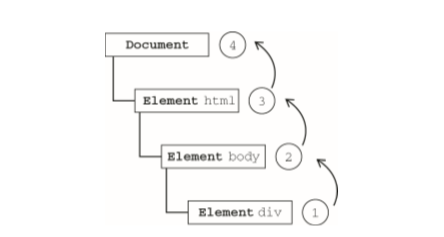

所有现代浏览器都支持事件冒泡，但在具体实现上还是有一些差别。IE5.5及更早版本中的事件冒 泡会跳S`<htna>`元素（从`<body>`直接跳到 `document` )。IE9、Firefox、Chrome 和 Safari 则将事件一直 冒泡到window对象。
### 13.1.2事件捕获
Netscape Communicator团队提出的另一种事件流叫做事件捕获（event capturing)。事件捕获的思想 是不太具体的节点应该更早接收到事件，而最具体的节点应该最后接收到亊件。事件捕获的用意在于在 事件到达预定S标之前捕获它。如果仍以前面的HTML页面作为演示事件捕获的例子，那么单击`<div>` 元素就会以下列顺序触发click事件。

1.` document`

2.`<html>`

3.`<body>`

4.`<div>`

在事件捕获过程中，document对象首先接收到click事件，然后事件沿DOM树依次向下，一直
传播到事件的实际H标，即<div>元索。图13-2展示了事件捕获的过程。
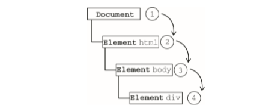

虽然事件捕获是Netscape Communicator唯一支持的事件流模型，但IE9、Safari、Chrome、Opera 和Firefox M前也都支持这种亊件流模型。尽管“D0M2级事件”规范要求事件应该从document对象 开始传播，们这些浏览器都是从window对象开始捕获事件的。

由于老版本的浏览器不支持.因此很少有人使用事件捕获。我们也建议读者放心地使用事件Wf泡， 在有特殊需要时再使用亊件捕获。
### 13.1.3DOM事件流
“DOM2级枣件”规定的事件流包括三个阶段：事件捕获阶段、处于U标阶段和事件9泡阶段。首 先发生的是事件捕获，为截获事件提供了机会。然后是实际的s标接收到事件。最后-个阶段是g泡阶 段，可以在这个阶段对事件做出响应。以前面简单的HTML页面为例，单击`<div>`元素会按照酌13-3所示顺序触发事件。
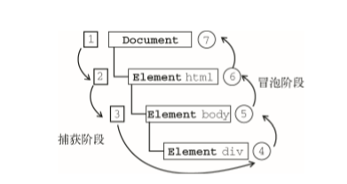
在DOM亊件流中，实际的U标（<div>元素）在捕获阶段不会接收到亊件。这意味着在捕获阶段, 事件从document:到<比1«1>再到<13〇办>后就停止了。下一个阶段是“处于目标”阶段，于是事件在<div> 上发生，并在事件处理（后面将会讨论这个概念）中被看成R泡阶段的一部分。然后，冒泡阶段发生， 亨件又传播回文档。

多数支持DOM事件流的浏览器都实现了一种特定的行为;即使“D0M2级事件”规范明确要求捕 获阶段不会涉及事件H标，但IE9、Safari、Chrome、Firefox和Opera9.5及更高版本都会在捕获阶段触 发爭件对象上的事件。结果，就是有两个机会在S标对象上面操作事件。

` IE9、Opera、Firefox、Chrome和Safari都支持DOM事件流;IE8及更早版本不 支持DOM事件流。`
## 13.2事件处理程序
事件就楚用户或浏览器自身执行的某种动作。诸如click、load和mouseover,都是事件的名字。 而响应某个亊件的函数就叫做亊件处理程序（或事件侦听器X事件处理程序的名字以_oti*开头，因此 click事件的事件处理程序就是onclick, load事件的事件处理程序就是onload。为事件指定处理 程序的方式有好几种。
### 13.2.1  HTML事件处理程序
某个元素支持的每种事件，都可以使用-个与相应事件处理程序同名的HTML特性来指定。这个 特性的值应该是能够执行的JavaScript代码。例如，要在按钮被单击时执行一些JavaScrip丨，可以像下面 这样编写代码：

`<input type="button" value="Click Me" onclick="alert('clicked')"/>`

当单击这个按钮时，就会显示一个聱告框。这个操作是通过指定onclick特性并将一些JavaScript 代码作为它的值来定义的。由于这个值是JavaScript,因此不能在其中使用未经转义的HTML语法字符， 例如和号（&)、双引号（"")、小于号（<)或大于号（>)。为了避免使用HTML实体，这里使用了单 引号。如果想要使用双引号，那么就要将代码改写成如下所示：

`<input LypG=-button- value="Click Me" onclick="alert(&quot;Clicked&quot;)" />`
在HTML中定义的事件处理程序可以包含要执行的具体动作，也可以调用在页面其他地方定义的 脚本，如下而的例子所示：
```
〈script type= * text/javascript * >
function showMessage(){
alert("Hello world!");
>
</script>
<input type="button- value="Click Me* onclick="showMessage() />
```
在这个例子中，单击按钮就会调用showMessage ()函数。这个函数是在一个独立的`<script>`元索 中定义的，当然也可以被包含在一个外部文件中。事件处理程序中的代码在执行时，有权访问全局作用 域中的任何代码。

这样指定市件处理程序具有-些独到之处。首先，这样会创建一个封装着元素属性值的函数。这个 闲数中有个外部变ft event,也就是事件对象（本章稍后讨论)：
```
<!--输出"click"-->
<input type=" but ton,r value="Click Me_ onclick=Balert (event, type)">
```
通过event变量，可以直接访问事件对象，你不用自己定义它，也不用从函数的参数列表中读取。 在这个闲数内部，this值等于事件的冃标元素，例如：
```
<!--输出"Click Me>
<input type^：" button" values "Click Me" onclick= "alert (this .value)">
```
关于这个动态创建的函数，另-个有意思的地方是它扩展作用域的方式。在这个函数内部，可以像 i方问局部变贵一样访问document及该元索本身的成员。这个喊数使用with像下面这样扩展作用域：
```
function(){
with(document){ with(this){
//元素属性值
```
如此一来，亊件处理程序要访问自d的属性就简笮多了。K面这行代码与前面的例子效果相同:
```
<!--输出"Click Me>
<input type^：" button" values "Click Me" onclick= "alert (value)">
```
如果当前元素是一个表单输入元素，则作用域中还会包含访问表单元索（父元素）的人口，这个函
数就变成了如下所示:
```
function(){
with(document){
with{thia.form){
with(this){
//元索属性值
    }
 }
}
```
实际上，这样扩展作用域的方式，无非就是想让亊件处理程序无需引用表单元素就能访问其他表单 字段。例如：
```
<form method="post">
<input type="text* name*"username'' value="''>
<input types'*bucton" value="Echo Username" onclick="alert (username.value)"> </£orr.>
```

在这个例子中，单击按钮会显示文本框中的文本。值得注意的是，这里:tli接引用了 username元素。 

不过，在HTML中指定事件处理程序有两个缺点。鋅先，存在一个时差问题。因为用户可能会在 HTML元索一出现在页面上就触发相应的事件，但当时的书件处理程序有可能尚不具备执行条件。以前面的例子来说明，假设showKessage()函数是在按钮下方、页面的最底部定义的。如果用户在页面解 析showMessage()函数之前就单击了按钮，就会引发错误。为此，很多HTML事件处理程序都会被封 装在一个try-catch块中，以便错误不会浮出水面，如下面的例子所示：

`<input type*"button- value-"Click Me" onclicks-try(showMessage();Jcacch(ex){}">`

这样，如果在showMessage()函数有定义之前单击丫按钮，用户将不会看到JavaScript错误，因为 在浏览器有机会处理错误之前，错误就被捕获了。

另一个缺点是，这样扩展事件处理程序的作用域链在不同浏览器中会导致不同结果。不同JavaScript 引擎遵循的标识符解析规则略有差异，很可能会在访问非限定对象成员时出错。

通过HTML指定事件处理程序的最后一个缺点是HTML与JavaScript代码紧密耦合。如果要更换事 件处理程序，就要改动两个地方：HTML代码和JavaScript代码。而这正是许多开发人员摒弃HTML車 件处理程序，转而使用JavaScript指定事件处理程序的原因所在。

`要了解关于HTML事件处理程序缺点的更多信息，请参考Garrett Smith的文章 'S^'Event Handler Scope" ( www.jibbering.com/faq/naines/event_hamller.htm]) 。`

### 13.2.2 DOMO级事件处理程序
通过JavaScript指定事件处埋程序的传统方式，就是将一个函数賦值给一个亊件处理程序属性。这 种为事件处理程序賦值的方法是在第四代Web浏览器中出现的，而且至今仍然为所有现代浏览器所支 持。原因一是简单，二是具有跨浏览器的优势。要使用JavaScript指定书件处理程序，首先必须取得一 个要操作的对象的引用。

每个元索（包括window和document)都有自己的节件处理程序属性，这些屈性通常全部小写， 例如onclick。将这种属性的值设置为一个函数，就可以指定事件处理程序，如下所示：
```var btn = document.getElemontByldf	);
btn.onclick = function(){
alert("Clicked");
};
```
在此，我们通过文档对象取得r -个按钮的引用，然耵为它指定了 onclick事件处理程序。但要 注意，在这些代码运行以前不会指定亨件处理程序，因此如果这些代码在页面中位于按钮后面，就有可 能在一段时间内怎么单击都没冇反应。

使用DOMO级方法指定的事件处理程序被认为是元索的方法。闲此，这时候的事件处理程序是在 元素的作用域中运行;换句话说，程序中的this引用当前元素。来符一个例子。
```
var btn = document.getElementById("myBtn")? btn.onclick = function(){
alert(this.id};	/"myBtn"
};
```
单击按钮®示的是元素的ID,这个ID是通过this .id取得的。不仅仅是ID,实际上可以在事件 处理程序中通过this访问元素的任何M性和方法。以这种方式添加的亊件处理程序会在事件流的冒泡
阶段被处理。

也可以删除通过DOMO级方法指定的事件处理程序，只要像下面这样将货件处理程序域性的值设 置为null即可：
`btn.onclick = null;	//州除事件处理程序`
将亊件处理程序设背为null之后，再单击按钮将不会有任何动作发生。
```
如果你使用HTML指定事件处理程序，那么onclick属性的值就是一个包含着 在同名HTML特性中

指定的代码的函数。而将相应的属性设里为null,也可以删除 以这种方式指定的事件处理程序。
```
### 13.2.3D0M2级事件处理程序`
“DOM2级車件”定义了两个方法，用于处理指定和删除事件处理程序的操作：addEventListenerO 和removeEventListener()。所有DOM节点中都包含这两个方法，并II它们都接受3个参数：要处 埋的事件名、作为事件处理程序的闲数和一个布尔值。最后这个布尔值参数如果是true,表示在捕获 阶段调用亊件处理程序;如果是false,表示在冒泡阶段调用亊件处理程序。

要在按钮上为click亊件添加事件处理程序，可以使用下列代码：
```
var btn = document.getElementByld("myBCn");
btn.addEventLiBtener("click", functionf){ alert(this.id);
}, false);
```
上面的代码为一个按钮添加了 onclick事件处理程序，而且该事件会在H泡阶段被触发（W为最 后-个参数是false)。与DOMO级方法一样，这里添加的事件处理程序也是在芄依附的元素的作用域 中运行。使用D0M2级方法添加事件处理程序的主要好处是可以添加多个事件处理程序。来看下面的 例子。
```
var btn = docuinenc .getElementById( "ntyBLn");
btn.addEventListener("click"# function(){
alert(this.id);
),false);
btn.addBventLiatener(Nclickn, function(){
alert("Hello worldl")/ ),false);
```

这里为按钮添加了两个事件处理程序。这两个亊件处理程序会按照添加它们的顺序触发，因此首先 会M示元素的ID,其次会显示"Hello world!"消息。
通过'addEventListener()'添加的事件处理程序只能使用'removeEventListener()'来移除;移 除时传人的参数>-j添加处理程序时使用的参数相N。这也意味着通过'addEventListener()'添加的匿 名函数将无法移除，如下而的例子所示。
```
var btn - document.getElcmentById("myBtn"); 
btn.addEventListener("click", function{){ alert(this.id);
}, false);
//这里省略了其他代码
btn.removoEventListen©r{ "click", function() { //没有用！ 
alert(this.id); false);
```
在这个例子中，我们使用addEventListener ()添加r一个事件处理程序〇虽然调用remove- EventListener ()时看似使用了相同的参数，但实际上，第二个参数与传人addEventListener (>中 的那一个是完全不同的函数。而传人removeSIventListenerO中的事件处理程序函数必须与传人 addEver.tListener ()中的相M，如下面的例子所亦。
```
var btn = document .getElexentById{ "nvBtn'*);
var handler » function(){
alert(this.id)j
);
btn^addEveixtliisteixer^^click*1, handler, false);
//这里省略了其他代码
btn.removeEventListener(nclick,r, handler, false); //有效！
```
重写后的这个例子没有问题，是因为在addEventListener ()和removeEventListener ()中使 用了相同的函数。

大多数情况下，都是将事件处理程序添加到琪件流的w泡阶段，这样可以最大限度地兼容各种浏览 器。最好只在需要在事件到达H标之前截获它的时候将事件处理程序添加到捕获阶段。如果不是特别需 要，我们不建议在事件捕获阶段注册事件处理程序。

`IE9、Firefox、Safari、Chrome 和 Opera 支持 D0M2 级事件处理程序。`
### 13.2.4 IE事件处理程序
IE实现了与DOM中类似的两个方法：atXachEvent:(>和detachEvent ()。这两个方法接受相同
的两个参数：事件处理程序名称与亊件处理程序闲数。由于IE8及更早版本只支持事件冒泡，所以通过attachEvent())添加的事件处理程序都会被添加到曾泡阶段。
要使用attachEvent ()为按钮添加一个事件处理程序，可以使用以下代码。
```
var btn = document.getElemei\tByI<3(u町Btn”;
 btn.attachBvent<"onclick", function(){ alert("Clicked")?
});
```
注意，attachEvent (}的第一个参数是1'onclick’_，而非 DOM 的 addEventListener ()方法中 的"click”。

在IE中使用attachEventO与使用DOMO级方法的主要K别在于事件处理程序的作用域。在使 用DOMO级方法的情况下，事件处理程序会在其所属元素的作用域内运行;在使用attachEvent()方 法的情况下，事件处理程序会在全局作用域中运行，因此this等于window。来看下面的例子。
```
var btn = document.getElementById("myBtn"); btn.attachSver.c {"onclick", function() { alert(this window); //true
));
```
在编写跨浏览器的代码时，牢记这一区別非常重要。
与addEventListener ()类似，attachEvent ()方法也可以用来为一个兀素添加多个事件处理程
序。来看下面的例子。
```
var bfcn - document.getElementByld(•myBtn");
 btn.attachEvent("onclick", function(H alert("Clicked-)?
))?
btn.attachEvent("onclick", function(){ alert("Hallo worldl");
>);
```
这里调用了两次attachEvent(>,为同一个按钮添加了两个不同的事件处理程序。不过，与DOM 方法不同的是，这些事件处理程序不是以添加它们的顺序执行，而是以相反的顺序被触发。单击这个例 子中的按钮，首先看到的是"Hello world! "，然后才是"Clicked"。

使用attachEvent (>添加的事件可以通过detachEvent ()来移除，条件是必须提供相同的参数。 与DOM方法一样，这也意味着添加的匿名函数将不能被移除。不过，只要能够将对相同函数的引用传 给detachEvent(),就可以移除相应的事件处理程序。例如：
```
var btn -• document ,getElementById("myBtn-); var handler = function(){ alert("Clicked");
};
btn.attachBvent("R"onclick", handler);
//这里名略了其他代码
btn.detachEvent("onclick", handler);
```
这个例了-将保存在变里handler中的函数作为事件处理程序。因此，后面的detachEventO可以 使用相间的函数来移除事件处理程序。

`支持IE事件处理程序的浏览器有IE和Opera`
### 13.2.5跨浏览器的事件处理程序
为了以跨浏览器的方式处理事件，不少开发人员会使用能够隔离浏览器差异的JavaScript库，还有 一些开发人员会自己开发最合适的事件处理的方法。自己编写代码其实也不难，只要恰当地使用能力检测即可（能力检测在第9章介绍过)。要保证处理事件的代码能在大多数浏览器下一致地运行，只需关 注冒泡阶段。

第一个要创建的方法是addHandlerO,它的职责是视情况分别使用DOMO级方法、DOM2级方 法或IE方法来添加亊件。这个方法属于一个名叫EventUtil的对象，本书将使用这个对象来处理浏览 器间的差异。addHandler()方法接受3个参数：要操作的元素、亊件名称和事件处理程序函数。

与addHandler()对应的方法是removeHandler(),它也接受相同的参数。这个方法的职责是移 除之前添加的事件处理程序——无论该事件处理程序是采取什么方式添加到元素中的，如果其他方法无 效，默认采用DOMO级方法。

EventUtil的用法如下所示。
```
var EventUtil = {
addHandler: function(element, type, handler){ if (element.addEventListener){
element.addSventListener(type, handler, false);
} else if (element.attachEvent){
element.attachEvent Con" + typo, handler);
} else {
element["on"十 type】=handler?
removeHandler： function(element, type, handler){ if (element.removeEventListener){
element.removeEventListener(type, handler, false); } else if (element.detachEvent){
element .detachEvent ("on1' + type, handler);
} else {
element F"on" + type] = null;
}
}
```
这两个方法首先都会检测传人的元素中是否存在DOM2级方法。如果存在DOM2级方法，则使用 该方法：传人事件类敢、事件处理程序函数和第三个参数false (表示冒泡阶段)。如果存在的是IE的 方法，贝採取第二种方案。注意，为了在〖E8及更早版本中运行，此时的亊件类型必须加上"on•前缀。 最后一种可能就是使用DOMO级方法（在现代浏览器中，应该不会执行这里的代码)。此时，我们使用 的是方括号语法来将属性名指定为事件处理程序，或者将属性设置为null。

口I以像下面这样使用EventUti]对象：
```
var btn = document.getElementById("myBtn");var handler = function(){ alert("Clicked");
);
BventUtil•addHandler(btn, "click*, handler);
//这里省略了其他代属
BventUti1.renoveBandler(btn# "click", handler);
```
acMHandler ()和removeHandler ()没有考虑到所有的浏览器问题，例如在IE中的作用域问题。 不过.使川它们添加和移除事件处理程序还是足够了。此外还要注意，DOMO级对每个事件只支持一 个事件处理程序。好在，只支持DOMO级的浏览器已经没有那么多了. W此这对你而言应该不是什么 问题。
## 13.3事件对象
在触发DOM上的某个事件时，会产生•-个事件对象event,这个对象中包含着所有与事件有关的 信息。包括导致事件的元素、亊件的类型以及其他与特定事件相关的信息。例如，鼠标操作导致的亊件 对象中，会包含S标位置的信息，而键盘操作导致的事件对象中，会包含与按下的键有关的信息。所有 浏览器都支持event对象，但支持方式不同。
### 13.3.1 DOM中的事件对象
兼容DOM的浏览器会将一个event对象传人到亊件处理程序中。无论指定事件处理程序时使用什 么方法（DOMO级或DOM2级），都会传人event对象。来看下面的例子。
```
var btn = document.getElementById{"myBtn")? btn.onclick =function(event){
alert(event.type);	//"click"
);
btn.addEventListener("click", function(event){ alert(event.type);	//"click"
}, false);
```
这个例了-中的两个事件处理程序都会弹出一个警告框，显示由event, type属性表示的事件类型。 这个属性始终都会包含被触发的事件类型，例如"click* (与传入add3EventListener()和 removeEventListener () 中的事件类型一致）。

在通过HTML特性指定事件处理程序时，变量event中保存着event对象。请看下面的例子。

`<input type='button* value:'Click Me_ onelick=*alert(event.type)"/>`

以这种方式提供event对象，可以让HTML特性事件处理程序与JavaScript函数执行相同的操作。 event对象包含与创建它的特定亊件侖关的属性和方法。触发的事件类型不一样，可用的属性和方 法也不一样。不过，所有事件都会有下表列出的成员。

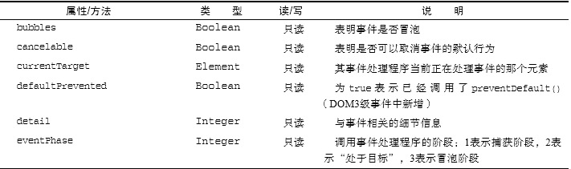
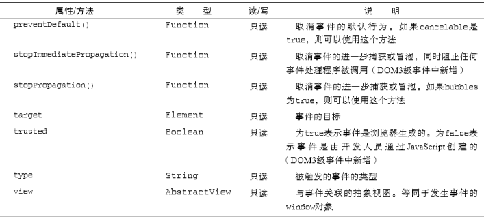


在事件处理程序内部，对象this始终等TcurrentTarget的值，而target()则只包含事件的实 际目标。如果直接将亊件处理程序指定给了目标兀素，则this、currentTarget和target包含相同 的值。来看下面的例子。
```
var btn = document.getElementByld^myBtn"}; btn.onclick • £uncti〇n<event){
alert(event.currentTarget =»= this); //true alert (event. target this);	"true
>/
```
这个例子检测了 currentTarget和target与this的值。由于click.事件的目标是按钮，因此 这三个值是相等的。如果事件处理程序存在于按钮的父节点中（例如document .body),那么这些值是 不相同的。再看下面的例子。
```
dociiment.body.onclick = function (event) {
alert{event.currentTarget === document.body);	//true
alert(this === document.body);	//true
alert {event. target *== document .getElementById( "myStn11)); //true
};
```
当单击这个例子中的按钮时，this和currentTarget都等于document.body,因为事件处理程 序是注册到这个元素上的。然而，target元素却等于按钮元素，因为它是click事件真正的目标。由 于按钮上并没有注册事件处理裎序，结果click事件就W泡到了 document.body,在那里事件才得到 了处理。

在需要通过一个函数处理多个亊件时，可以使用type属性。例如：
```
var ben = document.getElementByld(); var handler s £unction(event){
switch {event • type) { case "click":
alert < "Clicked11); break;
case "mouseover":
event•target.style.bacXgroundColor = "red"; break;
case "mouseout":
evant.target.style.backgroundColor = break;
>
>?
btn.onclick = handler; 
btn.onmouseover = bauidler; 
btn.oxunouseout =handler;
```

这个例子定义了一个名为handler的承数，用于处理3种事件：click、mouseover和mouseout。 当单击按钮时，会出现一个与前面例子中一样的警告框。当按钮移动到按钮上面时，背景颜色应该会变 成红色，而当鼠标移动出按钮的范围时，背贵颜色应该会恢复为默认值。这里通过检测event, type 属性，让闲数能够确定发生了什么事件，并执行相应的操作。

要租止特定事件的默认行为，可以使用preventDefaultO方法。例如，链接的默认行为就是在 被单击时会导航到其href特性指定的URL。如果你想阻止链接导航这一默认行为，那么通过链接的 onclick事件处理程序可以取消它，如下面的例子所示。
```
var link = document.getElenentByld("myLink-); 
link.onclick = function(event){
 event.preventDefault();
};
```
只有cancelable属性设置为true的事件，才可以使用preventDefault ()来取消其默认行为。
另外，stopPropagation()方法用于立即停止事件在DOM层次中的传播，即取消进一步的事件 捕获或冒泡。例如，直接添加到一个按钮的事件处理程序可以调用StopPr〇pagaticm(),从而避免触 发注册在document .body上面的事件处理程序，如下面的例子所示。
```
var btn = document.getElementById("myBtn");
 btn.onclick = function<event)( alert("Clicked"); event.stopPropagation();
};
docuttembody.onclick = functionteveiatn alert("Body clicked");
};
```
对于这个例子而言，如果不调用stopPropagation(),就会在单击按钮时出现两个警告框。可是, 由于click事件根本不会传播到document .body,因此就不会触发注册在这个元素上的onclick事 件处理程序。

书件对象的eventPhase属性，可以用来确定亊件当前正位于事件流的哪个阶段。如果是在捕获阶 段调用的事件处理程序，那么eventPhase等于1;如果事件处理程序处于目标对象上，则event- Phase等于2;如果是在冒泡阶段调用的亨件处理程序，eventPhase等于3。这里要注意的是，尽管 “处于H标”发生在0泡阶段，但eventPhase仍然一直等丁-2。来看下面的例子。
```
var btn = docun,.ent.getElGincntById("rayBtn"); btn.onclick = function(event){ alert (event. eventFhase); //2
};
document.body.addBventListener("click", function(event){ alert(event.eventPhase); //I }, true)?
document.body.onclick £unction{evdnt) { alert(event.eventPhase); //3
};
```
当单击这个例子中的按钮时，首先执行的事件处理程序是在捕获阶段触发的添加到document.body 中的那一个，结果会弹出一个螯告框显示表示eventPhase的1。接着，会触发在按钮上注册的事件处 理程序，此时的eventPhase值为2。烺后-个被触发的事件处理程序，是在泡阶段执行的添加到 document.body 上的那一个，显75 eventPhase 的值为 3。而肖 eventPhase 等于 2 时，this、target 和currentTarget始终都是相等的。
```
只有在事件处理程序执行期间，event对象才会存在;一旦事件处理程序执行完 成，
event对象就会被销毁。
```
### 13.3.2 IE中的事件对象
与访问DOM中的event对象不同，要访问IE中的event对象有几种不同的方式，取决于指定事
件处理程序的方法。在使用DOMO级方法添加事件处理程序时，event对象作为window对象的一个 属性存在。来看下面的例子。
```
var btn - document.getElementByld("n^Btn"); btn.onclick a £unction(){
var event * window.event; alert(event.type);	//"click"
};
```
在此，我们通过window.event取得了 event对象，并检测了被触发事件的类型（IE中的type 属性与DOM中的type属性是相同的)。可是，如果事件处理程序是使用attachEvent ()添加的，那 么就会有一个event对象作为参数被传人事件处理程序函数中，如下所示。
```
var btn = document.getElementById("myBtn"); btn.attachBvant (nonclic)ca, function(event) { alertfevant .type); //"cllcJc"
}) ;
```
在像这样使用attachEvent ()的情况下,也可以通过window对象来访问event对象，就像使用 DOMO级方法时一样。不过为方便起见，同一个对象也会作为参数传递。

如果是通过HTML特性指定的事件处理程序，那么还可以通过一个名叫event的变量来访问event 对象（与DOM中的事件模型相同)。再看一个例子。

`<input type="button* value="Click Me" onclick="alert(event.type)">`

IE的event对象同样也包含与创建它的事件相关的属性和方法。其中很多属性和方法都有对应的 或者相关的DOM属性和方法。与DOM的event对象一样，这些属性和方法也会因为事件类型的不同 而不间，但所有事件对象都会包含下表所列的属性和方法。


因为事件处理程序的作用域是根据指定它的方式来确定的，所以不能认为this会始终等于事件目 标。故而，最好还是使用event.srcElement比较保险。例如：
```
var btn = document.getElementById(•myBtn-); btn.onclick * £\mctlon() {
alert (window.event.srcElement sss this); //true
7
btn. attachSvent ("onclicJc", function (event) <
alert(event.srcBlement === this);	//false
})r
```
在第一个車件处理程序中（使用DOMO级方法指定的)，srcElement属性等于this,但在第二 个事件处理程序屮，这两者的值不相同。

如前所述，returnvalue属性相当于DOM中的preventDefault 〇方法，它们的作用都是取消 给定事件的默认行为。只要将returnvalue设S为false,就可以阻止默认行为。来看下面的例子。
```
 var link = dociunent.getElementByld("myLink");
link.onclick = function(){
window.event.returnValue = false;
```
这个例子在onclick事件处理程序中使用retumvalue达到/阻止链接默认行为的H的。与DOM 不同的是，在此没有办法确定事件是否能被取消。

相应地，cancelBubble属性与DOM中的stopPropagation()方法作用相同，都是用来停止事 件冒泡的。由于IE不支持亊件捕获，因而只能取消事件冒泡;何stopPropagatioinO可以同时取消 事件捕获和貿泡。例如：
```
var btn = document.getEleir.entByldC'myBtn"); 
btn.onclick = function(){ alert("Clicked");
window.event. cancelBubble = true;
};
document.body.onclick = £\inction()( alert("Body clicked");
);
```
通过在onclick事件处理程序中将cancelBubble设置为true，就可阻止事件通过S泡而触发 document.body中注册的事件处理程序。结果，在单击按钮之后，只会显示一个替告框。
### 13.3.3跨浏览器的事件对象
虽然DOM和IE中的event对象不同，但基丁"它们之间的相似性依旧可以拿出跨浏览器的方案来。 IE中event对象的全部信息和方法DOM对象中都有，只不过实现方式不•一样。不过，这种对应关系 让实现两种事件模型之间的映射非常容易。可以对前面介绍的EventUtU对象加以增强，添加如下方 法以求同存异。
```
var Eventutil = {
addHandler: function{element, type, handler){
//省略的代码
getBvent: function(event)<
return event ? event : window.event;
getTargett function(event){
return event.target || event.srcBlement;
preventDe£ault: function(event){ if (event.preventDefault){ event.preventDefault();
} else {
event.returnValue = false;
}
>,
reraoveHandler： function{element, type, handler) { //省略的代码
etopPropagation： function(event){

if (event.stopPropagation){ event .stopPropagationO;
event.cancelBubble
};
```
以上代码显示，我们为EventUtil添加了4个新方法。第一个是getEvent()，它返回对evept 对象的引用。考虑到IE中事件对象的位置不同，可以使用这个方法来取得event对象，而不必担心指 定事件处理程序的方式。在使用这个方法时，必须假设有一个事件对象传人到事件处理程序中，而且要 把该变量传给这个方法，如下所示。
```
btn.onclick
}?
event =
=function(event){ EventUtil.getEvent(event);
```
在兼容DOM的浏览器中，event变量只是简单地传人和返回。而在IE中，event参数是未定义 的（undefined),因此就会返回window.event。将这一行代奶添加到事件处理程序的开头，就可以确 保随时都能使用event对象，而不必担心用户使用的是什么浏览器。

第二个方法是getTarget (>,它返M事件的目标。在这个方法内部，会检测event对象的target 属性，如果存在则返回该属性的值;否则，返回srcElement属性的值。可以像下面这样使用这个方法。
```
btn.onclick = function(event){
event = Evencutil.getEvent(event); var target = EventUtil.getTarget(event);
};
```
第三个方法是preventDefault(),用于取消事件的默认行为。在传人event对象后，这个方法 会检査是否存在preventDefaultO方法，如果存在则调用该方法。如果preventDefault()方法不 存在，则将returnValue设置为false。下面是使用这个方法的例子。
```
var link = document.getElementByldt*myLink"); link.onclicX - function(event){
event = Eventntil.getEvent<event);
SventUtil.preventI>e£ault(event);
};
```
以上代码可以确保在所有浏览器中单击该链接都不会打开另一个页面。首先，使用EventUtU. geCEvent()取得event对象，然后将其传人到EventUtil.preventDefault()以取消默认行为。
第四个方法是stopPropagation (),其实现方式类似。首先尝试使用DOM方法阻止事件流，否 则就使用cancelBubble属性。下面看一个例子。
```
var btn = document.getBlejnentByld("myBtn"); 
btn.onclick = function(event)< alert(-Clicked");
event s Bventutil.getBvent(event); 
SvajatUtil.stopPropagation (event);
document.body.onclick = function(event){ alert("Body clicked");
```
在此，tt先使用EventUtil.getEventG取得f event对象，然后乂将其传入到EventUtil. stopPropagationU。别忘了由于丨E不支持爭件捕获，因此这个方法在跨浏览器的情况下，也只能用 来阻止事件冒泡。
## 13.4事件类型
Web浏览器中可能发生的亊件有很多类铟。如前所述，不同的亊件类型具有不同的信息，而“DOM3 级事件”规定了以下几类事件。
- [ ] UI (UserInterface,用户界面）事件，当用户与页面上的元素交互时触发;
- [ ] 焦点事件，当元素获得或失去焦点时触发;
- [ ] 鼠标事件，当用户通过鼠标在页面上执行操作时触发;
- [ ] 滚轮事件，当使用鼠标滚轮（或类似设备）时触发;
- [ ] 文本事件，当在文档屮输人文本时触发;
- [ ] 键盘事件，当用户通过键盘在页面h执行操作时触发;
- [ ] 合成事件，肖为IME (Input Method Editor,输人法编辑器）输人字符时触发;
- [ ] 变动（mutation)事件，当底层DOM结构发生变化时触发。
- [ ] 变动名称事件，当元素或属性名变动时触发。此类事件已经被废弃，没有任何浏览器实现它们， 因此本章不做介绍。

除了这儿类事件之外，HTML5也定义了一组事件，而有些浏览器还会在DOM和BOM中实现其他 专有事件。这些专有的事件一般都是根据开发人员需求定制的，没有什么规范，丙此不同浏览器的实现 有可能不一致。

DOM3级事件模块在DOM2级事件模块基础上重新定义了这些事件，也添加了一些新事件。包括 1E9在内的所有主流浏览器都支持DOM2级事件。[E9也支持DOM3级事件。
### 13.4.1 UI 事件
UI事件事件指的是那些不一定与用户操作有关的事件。这些亊件在DOM规范出现之前，都是以这 种或那种形式存在的，而在DOM规范中保留是为了向后兼容。现有的UI事件如下。
- [ ] DOMActivate••表示元索已经被用户操作（通过鼠标或键盘）激活。这个事件在D〇M3级事 件中被废弃，但Firefox2+和Chrome支持它。考虑到不同浏览器实现的差异，不建议使用这个 事件。

- [ ] load:当页面完全加载后在window上面触发，当所有框架都加载完毕时在框架集上面触发， 当图像加载完毕时在元素丨•.面触发，或淠，嵌人的内容加载完毕时在<〇)3;^£^>元素上面 触发。
- [ ] unload:汽页面完全卸载后在window上面触发，当所有框架都卸载后在框架集上面触发，或 者当嵌人的内容卸载完毕后在<〇刎6£：1：>元素上面触发。
- [ ] abort:在用户停止下载过程时，如果嵌人的内容没有加载完，则在<〇bjeCt>S素上面触发。
- [ ] error:当发生JavaScript错误时在window上面触发，当无法加载图像时在<1!^>元素上面触 发，当无法加载嵌人内容时在<〇bject>S素上面触发，或者当有一或多个框架无法加载时在框 架集t面触发。第17章将继续讨论这个事件。
- [ ] select:当用户选择文本框（`<input>^<texterea>` )中的一或多个字符时触发。第14章将 继续讨论这个事件。
- [ ] resize:当窗IU或框架的大小变化时在window或框架上面触发。
- [ ] scroll:当用户滚动带滚动条的元素中的内容时，在该元素上面触发。<)〇〇(^>元素中包含所加 载页面的滚动条。
多数这些事件都与window对象或表单控件相关。

除了DOMActivate之外，其他事件在DOM2级事件中都归为HTML事件(DOMActivate在DOM2 级中仍然属TUI事件)。要确定浏览器是否支持DOM2级事件规定的HTML事件，可以使用如下代码：

`var isSupported = document.implementation.hasFeature("HTMLEvents"," 3.0”;`

注意，只有根据“DOM2级亊件”实现这些事件的浏览器才会返回true。而以非标准方式支持这 些事件的浏览器则会返回false。要确定浏览器是否支持“DOM3级事件”定义的事件，可以使用如下 代码：

`var isSupported = document.implementation.hasFeature("UIEvent", "3.0");`

#### 1. load事件

JavaScript中最常用的一个亊件就是load。当页面完全加载后（包括所有图像、JavaScript文件、 CSS文件等外部资源）,就会触发window上而的load亊件。有两种定义onload事件处理程序的方式。 第一种方式是使用如下所示的JavaScript代码：
```
EventUtil.addHandler(window, "load" , function(event){ alert("Loaded!");
});
```
这是通过JavaScript来指定枣件处理程序的方式，使用了本章前面定义的跨浏览器的EventUtil 对象。与添加其他事件一样，这里也给事件处理程序传人了一个event对象。这个event对象中不包 含有关这个事件的任何附加信息，但在兼容DOM的浏览器中，event.target属性的值会被设置为 document，而IE并不会为这个事件设置srcElement属性。

第二种指定onload事件处理程序的方式是为`<body>`元素添加一个onload特性，如下面的例子 所示：
```
<!DOCTYPE html> <hunl>
<head>
<title>Load Event Example</title> </head>
<body onload="alert('Loaded!')">
</-body>
</html>
```

一般来说，在window上面发生的任何事件都可以在`<1>〇(^/>`元素中通过相应的特性来指定，W为 在HTML中无法访问window元素。实际上，这只是为了保证向后兼容的一种权宜之汁，但所有浏览器 都能很好地支持这种方式。我们建议读者尽可能使用JavaScript方式。

根据“DOM2级事件”规范，应该在document而非window上面触发load事 件。但是，所有浏览器都在window上面实现了该事件，以确保向后兼容。

图像t:面也可以触发load事件，尤_是在DOM屮的阐像元素还是HTML中的阁像元素。因此, 可以在HTML中为任何图像指定onload事件处理程序，例如：
```
<ing src="smile.gif" onload="alert('Image loaded.'}";
```
这样，当例子中的图像加载完毕后就会垃示一个督告框。同样的功能也可以使用JavaScript来实现, 例如：
```
var image = docunient.getElementByTd("myImagG");
EventUti1.addHandler(image, "load", function(event){ event = EventUt i1.get Event(even t); alert(EventUtil.gecTarget(event).src);
```
这里，使用JavaScript指定了 onload事件处理程序。同时也传入了 event对象，尽管它也不包含 什么办用的信息。不过，事件的目标是`<1呵>`元索，W此可以通过src属性访何并显示该信息。
在创建新的``元桌时，可以为其指定一个事件处理程序，以便罔像加载完毕后给出提示。此时, 最*要的是要在指定src属性之前先指定事件，如下面的例子所示。
```
EventUtil.addHandler(window, "load", function{){ var image = document.createElement("img");
EventUtil.addHandler(image, "load", functjon(event){ event = EventUtil.gctEvent(event); alert(EventUtil.geCTarget(event).src);
>);
document.body.appendChild(imago); image.src = "smile.gif";
>);
```
在这个例子中，首先为window指定了 onload亊件处理程序。原W在丁-，我们是想向DOM中添 加一个新元素，所以必须确定页面已经加载完毕——如果在页面加载前操作document .body会导致错 误。然后，创建了•-•个新的图像元索，并设置了其onload亊件处理程序。最后乂将这个图像添加到页 面中，还设置了它的srcM性。这里有一点需要格外注意：新图像元素不一定要从添加到文档后才开始 下载，只要设置了 src属性就会讦始K载。

间样的功能也可以通过使用DOMO级的image对象实现。在DOM出现之前，开发人员经常使用 image对象在客户端预先加载阁像。可以像使用元素一样使用Image对象，只不过无法将其添 加到DOM树中。下面来看-个例子。
```
EventUtil.addHandler(window, "load", function(){ var image = new Image();
EventUtil.addHandler(image, "load", function(event){ alert("Image loaded!■)?
});
image.src = "smile.gif";
} };
```
在此，我们使用image构造函数创建了 •个新图像的实例，然后又为仑指定了事件处理程序。有 的浏览器将Image对象实现为``元素，但并非所冇浏览器都如此，所以最好将它们区别对待。
在不属于DOM文档的图像（包括未添加到文档的``元素和Image对象)上 触发load事件时，IE8及之前版本不会生成event对象。IE9修复了这个问题。

还有一些元素也以非标准的方式支持load事件。在IE9+、Firefox、Opera、Chrome和Safari 3+及
更高版本中，`<script>`元索也会触发load事件，以便开发人员确定动态加载的JavaScript文件是否加 载完毕。与图像不同，只有在设S7`<script>`元素的srcW性并将该元素添加到文档后，才会开始下 载JavaScript文件。换句话说，对于`<SCript>`元素而言，指定src属性和指定事件处理程序的先后顺 序就不重要了。以下代码M示了怎样为`<SCript>`元素指定事件处理程序。
```
EventUtil.addHandler(window, "load", function(){ var script = document.createElement(n scriptH)/
EventUtil.addHandler(script, "load", £\inction(event) { alert(NLoadedn);
}>;
script • arc = "exanqple. jeN; document•body•appendChild(script);
});
```
这个例子使用了跨浏览器的EventUtil对象为新创建的`<body>`元素指定r〇nload事件处理程 序。此时，大多数浏览器中event对象的target属性引用的都`<script>`节点，而在Firefox3之前 的版本中，引用的则是document。IE8及更早版本不支持<script?^素上的load事件。

1E和Opera还支持`<11以>`元素上的load亊件，以便开发人员确定样式表是否加载完毕。例如：
```
EventUtil .addHandler (wir.dow, "load", function () { var link s document.createElement(M1inkn); linX.type = "text/cee"; link.rel= "stylesheet";
EventUti1.addHandler(1ink, "load", function(event){ alert {ncss loaded11);
))/
link.href » Hexample.cbs*1;
document.getEldment8ByTa9Name("head")[0].appendChild(link);
});
```
与`<scriPt>`有点类似，在未指定href屁性并将添加到文档之前也不会开始下载样式表。
#### 2. unload 事件
与load事件•应的是unload亊件，这个事件在文®被完全卸载后触发。只要用户从…个贞面切 换到另一个页面，就会发生unload事件。而利用这个事件最多的情况是清除引用，以避免内存泄漏。 与load事件类似，也有两种指定onunloa<5事件处理程序的方式3第一种方式足使用JavaScript，如 下所示：
```
EventUtil.addHar.dler (window, "unload*, function (event) { alert("Unloaded");
});
```
此时牛.成的event对象在兼容DOM的浏览器中只包含target属性（值为document )。IE8及之 前版本则为这个亊件对象提供了 srcElement属性。

指定事件处理程序的第二种方式，也是为`<body>`元紊添加一个特性（与load事件相似)，如F面 的例子所示：
```
<!DOCTYPR hcita>
<html>
<head>
<title>Unload Event Example</title>
</head>
<body onunload-"alert('Unloaded!')">
</body>
</html>
```
无论使用哪种方式，都要小心编写onunload事件处理程序中的代码。既然unload事件是在一切 都被卸载之后才触发，那么在页而加载后存在的那些对象，此时就不一定存在了。此时，操作DOM节 点或者元索的样式就会导致错误。
```
根据“DOM2级事件”，应该在`<body>`元素而非window对象上面触发unload 事件。
不过，所有浏览器都在windows上实现了 unload事件，以确保向后兼容。
```
#### 3. resize 事件
巧浏览器窗口被调整到一个新的高度或宽度时，就会触发resize事件。这个准件在window (窗 口）上面触发，W此可以通过JavaScript或者<13〇(1乂>元素中的onresize特性来指定亊件处理程序。如前所述，我们还是推荐使用如下所示的JavaScript方式：
```
EventUtil.addHandler(window, "resize-, function(event){ alert{"Resized")?
));
```
与;H;他发生在window上的事件类似，在兼容DOM的浏览器中，传人亊件处理程序中的event对 象有一个target属性，值为document;而IE8及之前版本则未提供任何属性。

关于何时会触发resize事件，不同浏览器有不同的机制。丨E、Safari、Chrome和Opera会在浏览 器窗口变化了 1像素时就触发resize事件，然后随着变化不断重复触发。Firefox则只会在用户停止调 整窗n大小时才会触发resize事件。由于存在这个差别，应该注意不要在这个事件的处理程序中加人 大计算最的代码，因为这些代码有可能被频繁执行，从而导致浏览器反应明显变慢。

`浏览器窗口最小化或最大化时也会融发resize事件。`

#### 4. scroll 事件
虽然scroll事件是在window对象上发生的，但它实际表示的则是贞面中相应元素的变化。在混 杂模式下，可以通过`<body>`元素的scrollLeft和scrollTop来监控到这一变化;而在标准模式下, 除Safari之外的所有浏览器都会通过`<html>`元素来反映这一变化（Safari仍然基于`<body>`跟踪滚动位 置），如下面的例子所示：

```
EventUtil.addHandler{window, "scroll", function(event){
if (document.compatMode == •CSSICompat"){
alert(document.documentElement.scrollTop);
} else {
alert(document.body.scrollTop);
}
});
```
以上代码指定的事件处理程序会输出页面的垂直滚动位置一根据呈现模式不同使用了不同的元 素。由于Safari 3.1之前的版本不支持document .compatMode,因此旧版本的浏览器就会满足第二个 条件。

与resize事件类似，scroll亊件也会在文档被滚动期间重复被触发，所以有必要尽量保持事件
处理程序的代码简单。

#### 13.4.2焦点事件
焦点事件会在页面获得或失去焦点时触发。利用这些事件并与document.hasFocusU方法及 document.activeElement属性配合，可以知晓用户在页面上的行踪。有以下6个焦点事件。
- [ ] blur:在元素失去焦点时触发。这个事件不会宵泡;所有浏览器都支持它。

- [ ] DOMFocusIn:在元素获得焦点时触发。这个事件与HTML事件focus等价，但它胃泡。只有 Opera支持这个事件。DOM3级事件废弃了 DOMFocusIn,选择了 focusin。

- [ ] DOMFocusOut:在兀素失去焦点时触发。这个事件是HTML事件blur的通用版本。只有Opera 支持这个事件。D0M3级事件废弃了 DOMFocusOut,选择了 focusout。
- [ ] focus :在元素获得焦点时触发。这个事件不会R泡;所有浏览器都支持它。
- [ ]focusin:在元索获得焦点时触发。这个事件与HTML事件focus等价，但它H泡。支持这个 亊件的浏览器有丨E5.5+、Safari 5.丨+、Opera 11.5+和 Chrome。
- [ ]focusout:在元素失i•焦点时触发。这个事件是HTML事件blur的通用版本。支持这个亊件 的浏览器有 IE5.5+、Safari 5.1+、Opera 11.5+和 Chrome。

这一类事件中最主要的两个是focus和blur,它们都是JavaScript甲期就得到所有浏览器支持的 亊件。这典事件的最大问题ft它们不W泡。W此，丨E的focusin和focusout .与Opera的DOMFocusIn 和DOMFocusOut才会发生璽符。IE的方式最后被D0M3级班件采纳为标准方式。

当焦点从页面屮的一个元素移动到另一个元素，会依次触发下列事件：
  1. focusout在失£-焦点的元素上触发;
  2. focusin在获得焦点的元素上触发;
  3. blur在失去焦点的元索上触发;
  4. DOMFocusOut在失去焦点的兀素L触发;
  5. focus在获得焦点的元素上触发;
  6. DOMFocusIn在获得焦点的元素1：触发。
其中，blur、DOMFocusOut:和focusout的事件H标是失去焦点的兀素;而focus、DOMFocusIn 和focusin的事件目标是获得焦点的元素。

要确定浏览器是否支持这咚事件，可以使用如下代码：

`var isSupported = document.implementation.hasFeature("FocusEvent", "3.0");`
```
即使focus和blur不冒泡，也可以在捕获阶段侦听到它们。Peter-PaulKoch就此
写过一篇非常棒的 [文章] (www.quirksmode.org/blog/archives/2008/04/ddegating_the.html)：
```
#### 13.4.3鼠标与滚轮事件
鼠标事件是Web开发中最常用的一类事件，毕竟鼠标还是最主要的定位设备。DOM3级事件中定 义了9个鼠标事件，简介如下。

- [ ] click:在川户单击主鼠标按钮（一般是左边的按钮）或者按下回车键时触发。这一点对确保 易访问性很重要，意味# onclick事件处理程序既可以通过键盘也可以通过鼠标执行。
- [ ] dblclick:在用户双击主鼠标按钮（一般是左边的按钮）时触发。从技术h说，这个事件并不 是DOM2级事件规范中规定的，但鉴丁-它得到了广泛支持，所以DOM3级事件将其纳入了标准。
- [ ]mousedown:在用户按任意鼠标按钮时触发。不能通过键盘触发这个事件。
- [ ]mouseenter:在鼠标光标从元素外部首次移动到元素范围之内时触发。这个事件不W泡，而且 在光标移动到后代元素上不会触发。DOM2级事件并没冇定义这个事件，佴DOM3级事件将它 纳人了规范。丨E、Firefox9+和Opera支持这个事件。
- [ ]mouseleave:在位于元素上方的鼠标光标移动到元素范围之外时触发。这个事件不胃泡，而且 在光标移动到后代元素上不会触发。DOM2级事件并没有定义这个事件，仴DOM3级事件将它 纳人丫规范。IE、Firefox9+和Opera支持这个亊件。
- [ ]tnousemove:当鼠标指针在元素内部移动时重复地触发。不能通过键盘舰发这个事件。
- [ ] mouseout:在鼠标指针位于一个元素上方，然后用户将其移人另一个元素时触发。乂移人的另 一个元素可能位丁•前一个元素的外部，也可能是这个元素的+元素。不能通过键盘触发这个事件。
- [ ]mouseover:在鼠标指针位于一个元素外部，然后用户将其首次移人另~个元素边界之内时触 发。不能通过键盘触发这个事件。
- [ ]mouseup:在用户释放鼠标按钮时触发。不能通过键盘触发这个事件。

页面上的所有元素都支持鼠标书件。除了 mouseenter和mouseleave,所有鼠标事件都会冒泡， 也可以被取消，而取消鼠标事件将会影响浏览器的默认行为。取消鼠标事件的默认行为还会影响其他事 件，因为鼠标事件与其他事件是密不可分的关系。	

只有在同一个元素匕相继触发mousedown和mouseup事件，才会触发click事件;如果 mousedown或mouseup中的一个被取消，就不会触发click事件。类似地，只有触发两次click事 件,才会触发一次dblclick事件。如果有代码阻止了连续两次触发click事件(可能是直接取消click 亨件，也可能通过取消mousedown或mouseup间接实现），那么就不会触发dblclick事件了。这4 个亊件触发的顺序始终如下：
```
(1).mousedown
(2).mouseup
(3).click
(4).mousedown
(5).nouseup
(6).click
(7).dblclick
```
当然，click和dblclick事件都会依赖于其他先行事件的触发;而mousedown和iaouseup则 不受其他亊件的影响。

IE8及之前版本中的实现有一个小bug，W此在双击事件中，会跳过第二个mousedcwn和click 事件，其顺序如下：

  1. mousedown 
  2. mouseup
  3. click
  4. mouseup
  5. cblclick
  
1E9修复了这个bug,之后顺序就正确了。

使用以下代码可以检测浏览器是否支持以上DOM2级事件（除dbclick、mouseenter和 mouseleave 之外）：

`var isSupported = document.implementation.hasFeature("MouseEvents","2.0"); `

要检测浏览器是否支持上面的所有事件，可以使用以下代码：

`var isSupported s document .implementation.hasFeature( "MouaeEvent","3,0"}`

注意，DOM3级事件的 feature 名是`MouseEvent` 而非`MouseEvents`。

鼠标事件中还有一类滚轮事件。而说是一类事件，其实就是一个mousewheel事件这个事件跟踪 鼠标滚轮，类似于Mac的触控板。

##### 1. 客户区坐标位置
鼠标亊件都是在浏览器视口中的特定位置上发生的。这个位置信息保存在事件对象的clientx和 clientY属性中。所有浏览器都支持这两个属性，它们的值表示事件发生时鼠标指针在视口中的水平 和垂立坐标。图13-4展示了视口中客户K坐标位置的含义。

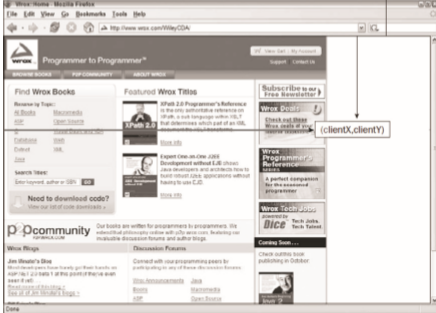

可以使用类似下列代码取得鼠标亊件的客户端坐标信息：
```
var div = document.getElementByldCmyDiv");
EventUti1.addHandler(div# "click"r function(event){ event = EventUt i1.get Event{event);
alert<"Client coordinates： • + event.clientx + "," +event.clientY);
});
```
这里为一个`<div>`元素指定了 onclick事件处理程序。当用户单击这个元素时，就会看到事件的 客户端坐标信息。注意，这些值中不包括页面滚动的距离，因此这个位置并不表示鼠标在页面上的位置。
##### 2. 页面坐标位置
通过客户区坐标能够知道鼠标是在视口中什么位置发生的，而页面坐标通过事件对象的pageX和 pageY屑性，能告诉你亊件是在页面中的什么位置发生的。换句话说，这两个M性表示鼠标光标在页面 中的位置，因此坐标是从页面本身而非视口的左边和顶边计算的。

以下代码可以取得鼠标事件在贞面中的坐标：
```
var div = docu^ent.getElementById{"myDiv");
EventUtil.addHandler(div, "click*, function(event){ event = EventUtil.getEvent(event);
alert('Page coordinates： " + event.pagoX + ","+ event.pageY)?
>);
```
在页面没有滚动的情况下，pageX和pageY的值与clientX和clients的值相等。

IE8及史平版本不支持事件对象上的页面坐标，不过使用客户区坐标和滚动信息可以计算出来。这 时候需要用到document.body (混杂模式）或document.documentElement^ (标准模式）中的 scrollLeft和scrollTop属性。计算过程如下所示：
```
var div = document.getElementById("myDiv"); EventUtil.addHandler(div, -click", function(event){ event = EventUtil.getRvent(event); var pageX = event.pageX, pageY s event.pageY;
if {pageX === undefined){
pageX = event.clientx + (document.body,scrollLeft II
document.documentElement.scrollLeft);
if (pageY pageY
===undefined){
=event.clientY + {document.body.scrollTop I(
document.documentElement.scrollTop);
alert("Page coordinates： _ + pageX +	+ pageY);
```
##### 3. 屏幕坐标位置
鼠标事件犮生时，不仅会有相对于浏览器窗U的位置，还有一个相对于整个电脑屏幕的位置。而通 过screenX和screenY属性就可以确定鼠标亊件发生时鼠标指针相对于整个屏幕的坐标信息。图13-5 展示了浏览器中屏幕坐标的含义。


可以使用类似下面的代码取得鼠标事件的屏幕坐标：
```var div = document.getElementById("myDiv");
EventUti1.addHandlor{div, "click", function(event){ event = EvenuUtil.getEvent(event);
alert ("Screen coordinates: "+ event. screeoX +*," + event. screenY);
));
```

与前一个例子类似，这里也是为`<div>`元素指定个OTClick事件处理程序。当这个元素被单 击时，就会M示出事件的屏幕坐标信息了。

##### 4.修改键

虽然鼠标事件主要是使用鼠标来触发的，但在按下鼠标时键盘上的某些键的状态也可以影响到所要 采取的操作。这些修改键就是Shift、Ctrl、Alt和Meta (在Windows键盘中是Windows键，在苹果机中 是Cmd键)，它们经常被用来修改鼠标車件的行为。DOM为此规定了 4个厲性，表示这些修改键的状 态：shiftKey、ctrlKey、altKey和metaKey。这些属性中包含的都是布尔值，如果相应的键被按 下了，则值为true,否则值为false。当某个鼠标事件发生时，通过检测这儿个属性就可以确定用户 是否同时按下了其中的键。来看下面的例子。
```
var div = document .getElementByldf "myDiv*');
 BventUtil.addHandler(div, "click*, function(event){ event = BventUtil.getEvent(event); 
 var keys = new Array();
if (event.shiftKey){
keys.push("shift");
}
if (event.ctrlKey){
keys .push (wctrl **);
if (event.altKey){
keys.push("alt");
if (event.mctaKcy){
keys.push{"meta*)?
alert("Keys: n + keys.join
});
```
在这个例子中，我们通过一个onclick事件处理程序检测T不同修改键的状态。数姐keys中包 含着被按卜的修改键的名称。换句话说，如果有《性值为true,就会将对应修改键的名称添加到keys 数组屮。在亊件处理程序的最后，有一个瞀告框将检测到的键的信息显示给用户。

```
IE9、Firefox、Safari、Chrome和Opera都支持这4个键。1E8及之前版本不支持 metaKey 属性。
```
##### 5. 相关元素
在发生mouseover和mouserout事件时，还会涉及更多的元素。这两个#件都会涉及把鼠标指 针从一个元素的边界之内移动到另-个元素的边界之内。对mouseover亊件而言，事件的主目标是获 得光标的元素，而相关元素就是那个失去光标的元素。类似地，对mouseout节件而言，事件的主11标 是失去光标的元索，而相关元尜则是获得光标的元索。来宥下面的例子。
```
<!DOCTYPE html>
<html>
<head>
<citle>Related Elements Examplc</title>
</head>
<body>
«3iv id=*nyDiv" style=Mbac)cground color：red;heighc：100px;width：100px;"></div> </body>
</html>
```

这个例子会在页面上显示元素。如果鼠标指针一开始位f这个`<div>`元素上，然后移出 了这个元素，那么就会在`<div>`元素上触发mouseont事件，相关元素就是<cody>元素。与此同时， `<body>`元素上面会触发mouseover亊件，而相关元素变成了`<div>`。

DOM通过event 的relatedTarget属性提供f相关元素的信息。这个属性只对于mouseover 和mouseout事件才包含值;对于其他事件，这个M性的值是nullGIE8及之前版本不支持relatedTarget 属性，{U提供丫保存着同样信息的+间厲性。在mouseover事件触发时，IEW£romElenient属性中保 存了相关元索;在mouseout亊件触发时，1E的toElement属性中保存着相关元素。（IE9支持所有这些 属性。）诃以把下面这个跨浏览器取得相关元素的方法添加到EventUtil Xt象中。
```
 var Eventutil = {
//省略了其他代码
getRelatedTarget: function(event){
if (event.relatedTarget){
return event.relatedTarget; )else if (event•toElement){ return event.toHlement;
> else if (event. frozoEleznent) { return event.fromEXement;
} else {
return null;
//省略了其他代码
);
```

与以前添加的跨浏览器方法一样，这个方法也使用'/特性检测來确定返H哪个值。可以像下面这样 使用 EventUt i 1. getRelat edTarget ()方法：
```
var div = document.getElementById("myDiv");
EventUti1.addHandler(div, "mouseout"4 function(event){ event = EventUtil.getEvent(event); var target = EventUti1.gecTarget(event); var relatedTarget = EventUtil.getRelatedTarget(event);
alert ("Moused out of * + target .tagNama + * to * relatedTarget .tagNaine);
});
```
这个例子为`<div>`元素的mouseout事件注册了一个事件处理程序。当事件触发时，会有一个瞀告 框毡示鼠标移出和移人的元素信息。
#### 6.鼠标按钮
只有在主鼠标按钮被单击（或键盘回车键被按下）时才会触发click事件，因此检测按钮的信息 并不是必要的。但对于mousedown和mouseup事件来说，则在其event对象存在一个button属性， 表示按下或释放的按钮。DOM的button属性可能有如下3个值：0表示主鼠标按钮，1表示中间的鼠 标按钮（鼠标滚轮按钮），2表示次鼠标按钮。在常规的设置中，主鼠标按钮就是鼠标左键，而次鼠标 按钮就是鼠标右键。

IE8及之前版本也提供了 button属性，但这个属性的值与DOM的button属性有很大差异。
- [ ] 0:表示没有按下按钮。
- [ ]1:表示按下了主鼠标按钮。
- [ ] 2:表示按下了次鼠标按钮。
- [ ]3:表示同时按下了主、次鼠标按钮。
- [ ]4:表示按下了中间的鼠标按钮。
- [ ]5:表示同时按下了主鼠标按钮和中间的鼠标按钮。
- [ ]6:表示同时按下了次鼠标按钮和中间的鼠标按钮。
- [ ]7:表示同时按下了三个鼠标按钮。

不难想见，DOM模型下的button属性比IE模型下的button属性更简单也更为实用，因为同时 按下多个鼠标按钮的情形十分罕见。最常见的做法就是将IE模型规范化为DOM方式，毕竟除IE8及更 早版本之外的其他浏览器都原生支持DOM模型。而对主、中、次按钮的映射并不困难，只要将IE的其 他选项分别转换成如同按下这三个按键中的一个即可（同时将主按钮作为优先选取的对象)。换句话说, IE中返回的5和7会被转换成DOM模型中的0。

由于单独使用能力检测无法确定差异（两种模型有同名的button屑性)，因此必须另辟蹊径。我 们知道，支持DOM版鼠标事件的浏览器可以通过hasFearture()方法来检测，所以可以再为 EventUtil对象添加如下getButton()方法。
```
var EventUtil = {
//省略了其他代码 
getButtont funct ion(event){
1f (docmment.laplementation.haaFeature("MouseEvents", "2.0••)) { return event.button;
} else {
switch(event.button){ 
case 0;
case 1: 
case 3: 
case 5:
return 0;
case:
case:
return 2;
return 1;
//省略了其他代码
};
```
通过检测"MouseEvents"这个特性，就可以确定event对象中存在的button属性中是否包含正 确的值。如果测试失败，说明是IE,就必须对相应的值进行规范化。以下是使用该方法的示例。
```
var div = document .getEleinentById( "myDiv");
EventUtil.addH&ndler(div,"mousedownM# function(event){
event « BventUtll.getBvent(event);
alQrt{BventUtil.getButton(evdXit));
));
```
在这个例子中，我们为一个`<div>`元素添加了一个onmousedown事件处理程序。当在这个元素上 按下鼠标按钮时，会有警告框显示按钮的代码。
```
在使用onmouseup事件处理程序时，button的值表示释放的是哪个按钮。此 外，如果不是按下或释放了主鼠标按钮，Opera不会柏发mouseup或mousedown 事件。
```
##### 7.更多的事件信患
“COM2级事件”规范在event对象中还提供了 detail属性，用于给出有关事件的更多信息。对 于鼠标事件来说，detail中包含了一个数值，表示在给定位置上发生了多少次笮击。在同一个像素上 相继地发生一次mousedown和一次mouseup事件算作一次单击。detail属性从1开始计数，每次单 击发生后都会递增。如果鼠标在mousedown和mouseup之间移动了位置，则detail会被重置为0。

IE也通过下列属性为鼠标事件提供了更多信息。
- [ ]  altLeft:布尔值，表水是否按下了 Alt键。如果altLeft的值为true，则altKey的值也为true。 
- [ ] ctrlLeft:布尔值，表不足否按下了 Ctrl键。如果ctrlLeft的值为true,则ctrlKey的值 也为true。
- [ ]offsetx:光标相对于目标元素边界的x坐标。
- [ ] offsetY:光标相对于目标元素边界的y坐标。
- [ ]shiftLeft:布尔值，表示是否按下了 Shift键。如果shiftLeft的值为true,则shiftKey 的值也为true。

这些属性的用处并不大，原因一方面是只右IE支持它们，另一方是它们提供的信息要么没有什么 价值，要么可以通过其他方式计算得来。
##### 8鼠标滚轮事件
IE 6.0首先实现了 mousewheel事件。此后，Opera、Chrome和Safari也都实现了这个事件。当用 户通过鼠标滚轮与页面交互、在垂直方向h滚动页面时（无论向上还是向下），就会触发mousewheel 事件。这个事件可以在任何元素上面触发，最终会胃泡到document (IE8)或window (IE9、Opera、 Chrome及Safari)对象。与mousewheel事件对应的event对象除含鼠标事件的所有标准信息外， 还包含一个特殊的wheelDelta属性。当用户向前滚动鼠标滚轮时，wheelDelta是120的倍数;当用 户向后滚动鼠标滚轮时，wheelDelta是-120的倍数。图13-6展示了这个属性。

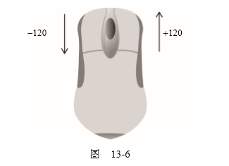

将mousewheel事件处理程序指定给页面中的任何元素或document对象，即可处理鼠标滚轮的 交互操作。来看下面的例子。
```
EventUtil.addHandler(document, "mousewheel•, function(event){ event = EventUtil.getEvenc(event); alert(event.whcclDelta)?
});
```
这个例子会在发生mousewheel事件时显示wheelDelta的值。多数情况下，只要知道鼠标滚轮 滚动的方向就够了，而这通过检测wheelDelta的正负号就可以确定。

有一点要注意：在Opera 9.5之前的版本中，wheelDelta值的正负号是颠倒的。如果你打算支持 早期的Opera版本，就需要使用浏览器检测技术来确定实际的值，如下面的例子所示。
```
EventUtil.addHandler(document, "mousewheel", function{event>{ event = EventUtil.getEvent(event);
var delta a (client.«ngin«.opera &ft client.engine.opera < 9.5 ?.
-event.wheelOelta : event.whe«lDelta);
alert(delta);
});
```

以上代码使用第9章创建的client对象检测了浏览器是不是早期版本的Opera。
```
由于mousewheel事件非常流行，而且所有浏览器都支持它，所以HTML5也加 入了该事件。
```
Firefox支持一个名为DOMMouseScroll的类似事件,也是在鼠标滚轮滚动时触发。与mousewheel 事件样，DOMMouseScroll也被视为鼠标事件，因而包含与鼠标事件有关的所有属性。而有关鼠标滚 轮的信息则保存在detail属性中，当向前滚动鼠标滚轮时，这个属性的值是-3的倍数，当向后滚动 鼠标滚轮时，这个属性的值是3的倍数。图13-7展示了这个属性。
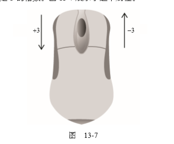

可以将DOMMouseScroll事件添加到页面中的任何元素，而且该事件会冒泡到window对象。因 此，可以像下面这样针对这个事件来添加事件处理程序。
```
EventUtil.addHandler(window, "DOMMouseScroll”， function(event){ event = EventUtil.getEvent(event); alert(event.detail);
”);
```

这个简单的事件处理程序会在鼠标滚轮滚动时显示detail属性的值。
若要给出跨浏览器环境下的解决方案，第一步就是创建一个能够取得鼠标滚轮增最值（delta)的方 法。下面是我们添加到EventUtil对象中的这个方法。
```
var EventUtil = {
//省略了其他代码
getWheelDelta: function(event){ if (event .wheell>elta) {
return (clieQt»engine.opera && client.engine.opera < 9.5 ?
-event.wheelDelta s event.wheelDelta);
) else {
return -event.detail *40;
//省略了其他代码
};
```
这里，getWheelDeltaO方法首先检测了事件对象是否包含wheelDelta属性，如果是则通过浏 览器检测代码确定正确的值。如果wheelDelta不存在，则假设相应的值保存在detail属性中。由于 Firefox的值有所不同，因此首先要将这个值的符号反向，然后再乘以40,就可以保证与其他浏览器的 值相同了。有了这个方法之后，就可以将相同的事件处理程序指定给mousewheel和DOMMouse- Scroll事件了，例如：
```
EventUtil.addHandler(document, "mousewheel", handleMouseWheel);
Eventuti1.addHand1er(document, *DOMMouseScroll* # handleMouseWheel};
})();
{function(){
function handleMouseWheel(event){
event = EventUtil.getEvent(event);
var delta = EventUtil.getWheclDelta(event);
alert(delta);
```
我们将相关代码放在了一个私有作用域中，从而不会it新定义的函数干扰全局作用域。这里定义的 handleMouseWheel ()函数可以用作两个事件的处理程序（如果指定的事件不存在，则为该事件指定处 理程序的代码就会静默地失败)。由于使用了 EventUtil.getWheelDelta()方法，我们定义的这个事 件处理程序函数可以适用于任何一种情况。
##### 9.触摸设备
iOS和Android设备的实现非常特别，因为这些设备没有鼠标。在面向iPhone和iPod中的Safari 开发时，要记住以下几点。
- [ ] 不支持dblclick事件。双击浏览器窗口会放大両面，而且没有办法改变该行为。
- [ ] 轻击可单击元素会触发mousemove事件。如果此操作会导致内容变化，将不再有其他事件发生; 如果屏幕没有因此变化，那么会依次发生mousedown、mouseup和click事件。轻击不可单 击的元素不会触发任何节件。可单击的元素是指那些单击可产生默认操作的元素（如链接），或 者那些L1经被指定f onclick事件处理程序的元素。
- [ ]  mousemove 事件也会触发 mouseover 和 mouseout 事件。
- [ ] 两个手指放在屏幕上且页面随手指移动而滚动时会触发mousewheel和scroll事件。
##### 10. 无陣碍性问题
如果你的Web应用程序或网站要确保残疾人特别是那些使用屏幕阅读器的人都能访问，那么在使 用鼠标事件时就要格外小心。前面提到过，可以通过键盘上的回车键来触发click亊件，但其他鼠标 亊件却无法通过键盘来触发。为此，我们不建议使用click之外的其他鼠标事件来展示功能或引发代
码执行。因为这样会给肓人或视障用户造成极大不便。以下是在使用鼠标事件时应当注意的几个易访问 性问题。
口使用click事件执行代码。有人指出通过onmousedown执行代码会让人觉得速度更快，对视 力正常的人来说这是没错的。但是，在屏幕阅读器中，由于无法触发mousedown事件，结果就 会造成代码无法执行。
- [ ] 不要使用onmouseover向用户显示新的选项。原因同上，屏幕阅读器无法触发这个事件。如果 确实非要通过这种方式来M示新选项，可以考虑添加显示相同信息的键盘快捷方式。
- [ ] 不要使用dblclick执行重要的操作。键盘无法触发这个事件。
遵照以上提示可以极大地提升残疾人在访问你的Web应用程序或网站时的易访问性。
```
要了解如何在网瓦中实现无啤碍访问的内容，请访问www.webaim.org和 

http://yaccessibilityblog.com/。
```
#### 13.4.4键盘与文本事件
用户在使用键盘时会触发键盘事件。“DOM2级事件”最初规定了键盘氺件，但在最终定稿之前又 刪除了相应的内容。结果，对键盘車件的支持主要遵循的是DOMO级。
“D0M3级事件”为键盘事件制定了规范，丨E9率先完全实现了该规范。其他浏览器也在着手实现这 一标准，但仍然有很多遗留的问题。
有3个键盘事件，简述如下。
- [ ]keydown:当用户按下键盘上的任意键时触发，而且如果按住不放的话，会重复触发此事件。
- [ ] keypress:当用户按下键盘上的字符键时触发，而且如果按住不放的话，会重复触发此事件。 按下Esc键也会触发这个亊件。Safari 3.1之前的版本也会在用户按下非字符键时触发keypress 事件。
- [ ] keyup:当用户释放键盘h的键时触发。
虽然所有元素都支持以上3个事件，但只有在用户通过文本框输人文本时才最常用到。

只有一个文本事件：textlnput。这个事件是对keypress的补充，用意是在将文本显示给用户之 前更容易拦截文本。在文本插入文本框之前会触发text Input事件。

在用户按了一下键盘上的字符键时，首先会触发keydown亊件，然后紧跟着是keypress事件， 最后会触发keyup事件。其中，keydown和keypress都是在文本框发生变化之前被触发的;而keyup 亊件则是在文本框已经发生变化之后被触发的。如果用户按下了一个字符键不放，就会重复触发 keydown和keypress事件，直到用户松开该键为止。

如果用户按下的是一个非字符键，那么首先会触发keydown事件，然后就是keyup事件。如果按 住这个非字符键不放，那么就会一直重复触发keydown事件，直到用户松开这个键，此时会触发keyup 事件。
^	键盘事件与鼠标事件一样，都支持相同的修改键。而且，键盘事件的事件对象中也有 shiftKey、ctrlKey、altKey 和 metaKey 属性。IE 不支持 metaKey。

##### 1.键码
在发生keydown和keyup亊件时，event对象的keyCode属性中会包含一个代码，与键盘上- 个特定的键对应。对数字字母字符键，keyCode M性的值与ASCII码中对应小写字母或数字的编码相
间。因此，数字键7的keyCode值为55，ntf字母A键的keyCode值为65	与Shift键的状态无关。
DOM和IE的event对象都支持keyCode属性。请看下面这个例子：
```
var textbox = document.getElemenCByld("myToxt");
EventUtil.addHandler(textbox, •keyup", function(event){ event = EventUtil.getEvent(event)? alert(event.koyCode);
));
```
在这个例子中，用户每次在文本框中按键触发:ceyup事件时，都会显示keycode的值。下表列出 了所有非字符键的键码。

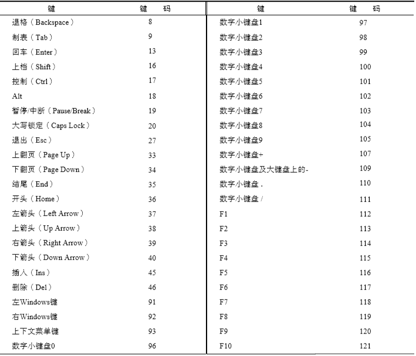
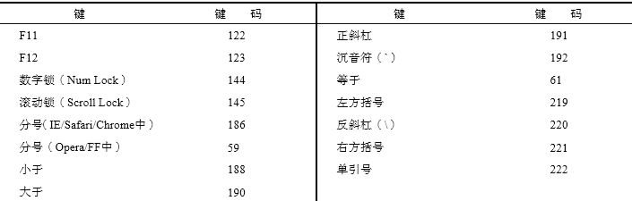

无论keydown或keyup事件都会存在的一些特殊情况。在Firefox和Opera中，按分号键时keyCode 值为59,也就是ASCII中分号的编码;但IE和Safari返问186,即键盘中按键的键码。
##### 2.字符：编码
发生keypress事件意味着按下的键会影响到屏幕中文本的显示。在所有浏览器中，按下能够插人 或删除字符的键都会触发keypress事件;按下其他键能否触发此事件因浏览器而异。由于截止到2008 年，尚无浏览器实现“DOM3级事件”规范，所以浏览器之间的键盘事件并没冇多大的差异。

IE9、Firefox、Chrome和Safari的event对象都支持一个charCode属性，这个属性只有在发生 keypress事件时才包含值，而且这个值是按下的那个键所代表字符的ASCII编码。此时的keyCode 通常等于0或者也可能等于所按键的键码。IE8及之前版本和Opera则是在keycode中保存字符的ASCII 编码。要想以跨浏览器的方式取得字符编码，必须首先检测charcode属性是否可用，如果不可用则使 用keyCode,如下面的例子所示。
```
var EventUtil = {
//省略的代码
getCharCode: £unction(event>{
if (typeof event.charCode == "number**) { return event.charCode;
else {
return event.keyCode;
>
//省略的代码
```

这个方法首先检测charCode属性是否包含数值（在不支持这个属性的浏览器中，值为undefined ), 如果是，则返回该值。否则，就返回keyCode属性值。下面是使用这个方法的示例。
```
var textbox = document.getElementByld{"myText");
EventUtil.addHandler(textbox, "keypress", function(event){ event = EventUtil.gotEvent(event);
alert(BventUtil.getCbarCode(event));
));
```
在取得了字符编码之后，就可以使用String. fromCharCodeO将其转换成实际的字符。
##### 3. D0M3级变化
尽管所有浏览器都实现了某种形式的键盘事件，D0M3级事件还是做出了一些改变。比如，D0M3 级事件中的键盘事件，不再包含charCode属性，而是包含两个新属性：key和char。

其中，key属性是为了取代keyCode而新培的，它的值是一个字符串。在按F某个字符键时，key 的值就是相应的文本字符（如“k"或“M”）;在按下非字符键时，key的值是相应键的名（如“Shift” 或“Down”)。而char属性在按K字符键时的行为与key相同，但在按下非字符键时值为null。

1E9支持key属性，但不支持char属性。Safari 5和Chrome支持名为keyldentifier的属性， 在按下非字符键（例如Shift )的情况下与key的值相同。对于字符键，keyldentif ier返回一个格式
类似“U+0000”的字符串，表示Unicode值。
```
var textbox = document.getElementById("myText");
Event'Jtil. addHandlcr (textbox, "keypress" , function (event) { event = EventUtil.getEvent(event);
var identifier > event.key ( I event.Iceyldentifier; if (identifier){
alert(identifi  er);
}
));
```
由于存在跨浏览器问题，因此本书不推荐使用key、keyldentifier或char。
D0M3级事件还添加了一个名为location的属性，这是一个数值，表示按下丫什么位置上的键:0表示默认键盘，丨表示左侧位置（例如左位的Alt键)，2表示右侧位置（例如*侧的Shift键)，3表示 数字小键盘，4表示移动设备键盘（也就是虚拟键盘)，5表示手柄（如任天堂Wii控制器)。IE9支持这 个属性。Safari和Chrome支持名为keyLocation的等价属性，但即有bug——值始终是0,除非按下 了数字键盘（此时，值为3);否则，不会是1、2、4、5。
```
var textbox = document.getElementByld("myText");
EventUtil.addHandler(textbox, "keypress*, function(event){ event = EventUtil.getEvent(event); var loc = event«location I) event.keyLocation; if (loc){
Alert(loc);
)
));
```

与key属性一样，支持location的浏览器也不多，所以在跨浏览器开发中不推荐使用。

最后娃给event对象添加了 getModifierState(r方法。这个方法接收一个参数，即等于Shift、 Control、AltGraph或Meta的字符串，表示要检测的修改键。如果指定的修改键是活动的（也就是 处于被按下的状态），这个方法返回true,否则返回 false。
```
var textbox = document .getBiement By Id ("n^Text");
EventUtil.addHandler{textbox, "keypress", function(event){
event = EventUtil.getEvent(event);
if (event.getModifierState){
alert(event.getKodifierState("Shi£tN));
))
```

实际上，通过event对象的shiftKey、altKey、ctrlKey和metaKey属性已经可以取得类似 的属性了。IE9是唯一支持getModifierState ()方法的浏览器。
##### 4. textlnput 事件
“D0M3级事件”规范中引人了一个新事件，名叫textlnput。根据规范，肖用户在可编辑区域中 输人字符时，就会触发这个亊件。这个用于替代keypress的textlnput事件的行为稍有不同。区别 之一就是任何可以获得焦点的元素都可以触发keypress事件，但只冇可编辑K域才能触发text Input 事件。区别之二是textlnput事件只会在用户按下能够输人实际字符的键时才会被触发，而keypress 事件则在按下那些能够影响文本显示的键时也会触发（例如退格键)。

由于textlnput事件主要考虑的是字符，因此它的event对象中还包含一个data属性，这个属 性的值就是用户输人的字符（而非字符编码)。换句话说，用户在没有按上档键的情况下按下f S键， data的值就是-s"，而如果在按住上档键时按下该键，data的值就是"S"。
以下是一个使用textlnput事件的例子：
```
var textbox = document.getElementByld("myText*);
EventUtil.addHandler(textbox, "textlnput"» function(event){ event ■ BventUtil.getEvent(event); alert(«vent.data);
));
```
在这个例子中，插人到文本框中的字符会通过一个警告框M示出来。
另夕卜，event对象上还布一个属性，叫inputMethod，表示把文本输人到文本框中的方式。
- [ ]0,表示浏览器不确定是怎么输入的。
- [ ] 1,表示是使用键盘输入的。
- [ ] 2,表示文本是粘贴进来的。
- [ ]3,表示文本是拖放进来的。
- [ ]4,表示文本是使用IME输入的。
- [ ] 5,表本文本是通过在表单中选择某一项输人的。
- [ ]6,表示文本是通过手写输人的（比如使用手写笔)。
- [ ]7,表示文本是通过语音输入的。
- [ ]8,表示文本是通过几种方法组合输人的。
- [ ]9,表示文本是通过脚本输人的。

使用这个属性可以确定文本是如何输人到控件中的，从而可以验证其有效性。支持textlnput属 性的浏览器有IE9+、Safari和Chrome。只有IE支持inputMethod属性。

##### 5.设备中的键盘事件

任天堂Wii会在用户按下Wii遥控器上的按键时触发键盘事件。尽管没有办法访问Wii遥控器中的 所有按键，但还是有-些键可以触发键盘事件。图13-6展示了一些键的键码，通过这些键码可以知道 用户按下了哪个键。
(无法访问）

i[](images/18755.png)

当用户按下十字键盘（键码为175 ~ 178 )、减号（170 )、加号（174 )、1 (172 )或2 (173 )键时就 会触发键盘事件。但没有办法得知用户是否按下了电源开关、A、B或主页键。 iOS版Safari和Android版WebKit在使用屏幕键盘时会触发键盘亊件。
### 13.4.5复合事件
复合事件（composition event)是DOM3级亊件中新添加的一类事件，用于处理IME的输人序列。 IME( Input Method Editor,输人法编辑器）可以让用户输人在物理键盘上找不到的字符。例如，使用拉 丁文键盘的用户通过IME照样能输人日文字符。IME通常需要同时按住多个键，fllfi终只输人一个字 符。复合事件就是针对检测和处理这种输人而设计的。有以下三种复合事件。
- [ ]  compositionstart:在IME的文本复合系统打开时触发，表示要开始输入了。
口 compositionupdate:在向输人字段中插人新字符时触发。
- [ ]  compositionend:在IME的文本复合系统关闭时触发，表7K返lH]正常键盘输人状态。
复合事件与文本事件在很多方面都很相似。办:触发复合事件时，3标是接收文本的输入字段。但它 比文本亊件的亊件对象多--个属性data,其中包含以下几个值中的一个：
- [ ] 如果在compositiioiistart事件发生时访间，包含正在编辑的文本（例如，已经选中的需要马 h替换的文本);
口如果在compositionupdate亨件发也时访问，包含正插人的新字符;
- [ ] 如果在compositionend事件发也时访问，包含此次输人会话中插入的所有字符。
与文本事件一样，必要时可以利用复合箏件来筛选输人。可以像下面这样使用它们：
```
var textbox - document.getElementById("n^Text");
BventUtil.addHandler(textbox, "cozapoBitionstart", function(event)< event * EventUti1.getEveat(event >; alert(event.data);
))?
EventUtil*addHandler(textbox* "compoaitionupdate", function(event){ event 騰 EventUtil.getEvent(event); alert(event.data);
>);
BventUtll•addHandler(textbox, "cozopoaitionand", function(event){ event = EventOtil.getEvent(event); alert(event.data);
))?
```

IE9+是到2011年唯一支持复合事件的浏览器。由丁缺少支持，对于笛要开发跨浏览器应用的开发 人员，它的用处不大。要确定浏览器足否支持笈合事件，可以使用以下代码：
```
var isSupported = document.inplemeni:ation.hasFcat;\ire("ConiposLtionEvent-, " 3.0") ?
```
### 13.4.6变动事件
DOM2级的变动(mutation)事件能在DOM中的某一部分发生变化时给出提示。变动事件是为XML 或HTML DOM设计的，并不特定于某种语言。DOM2级定义了如下变动事件。

- [ ]DOMSubtreeModified:在DOM结构中发生任何变化时触发。这个事件在其他任何事件触发 后都会触发。
- [ ]DOKNodelnserted:在一个节点作为子节点被插人到另--个节点中时触发。
- [ ]DOMNodeRemoved:在节点从其父节点中被移除时触发。
- [ ]DOMNodelnsertedlntoDocument:在一个节点被立接插人文梢或通过子树间接插人文构之后 触发。这个#件在DOMNodelnserted之后触发。
- [ ]DOMNodeRemovedFromDocument :在一个节点被i£接从文档中移除或通过子树间接从文柄中移 除之前触发。这个亊件在DOMNodeRemoved之后触发。
- [ ]DOMAttrModified:在特性被修改之后触发。
- [ ]DOMCharacterDataModified:在文本节点的值发生变化时触发。

使用下列代码可以检测出浏览器是否支持变动事件：
```
var isSupported = document.implementation.hasFeature("MutationKvents-, "2.0");
```
IE8及更¥版本不支持任何变动亊件。下表列出了不同浏览器对不同变动事件的支持情况。

由丁- DOM3级事件模块作废/很多变动事件，所以本节只介绍那些将来仍然会得到支持的事件。

#### 1.删除节点
在使用removeChild ()或repiaceChild ()从DOM中删除节点时，首先会触发DOMNodeRemoved 事件。这个事件的0标（event.target )是被删除的节点，而event.relatedNode属性中包含着对 目标节点父节点的引用。在这个事件触发时，节点尚未从其父节点删除，因此其parentNodeM性仍然 指向父，点（与event.relatedNode相同）。这个事件会冒泡，因而可以在DOM的仟何层次上面处 理它。

如果被移除的节点包含子节点，那么在其所有子节点以及这个被移除的节点上会相继触发 DOMNodeRemovedFromDocument事件。但这个事件不会冒泡，所以只有直接指定给其中一个子节点的 事件处理程序才会被调用。这个事件的H标是相应的子节点或者那个被移除的节点，除此之外event 对象中不包含其他信息。
紧随其后触发的是DOMSubtreeModified事件。这个亊件的B标是被移除节点的父节点;此时的 event对象也不会提供与事件相关的其他信息。

为了理解上述事件的触发过程，下面我们就以一个简单的HTML页面为例。
```
<! DOCTYPE html>
<html>
<head>
<title>Node Removal Events Example</title>
</head>
<body>
<ul id=nmyList',>
<li>Item l</li>
<li>Item 2</li>
3</li>
</ul>
</body>
</html>
```
在这个例子中，我们假设要移除`<ul>`元素。此时，就会依次触发以下事件。
在`<ul>`兀素上触发 DOMNodeRemoved 事件。relatedNode 属性等于 document .<`body>。

在`<ul>`兀素上触发 DOMNodeRemovedFromDocument 事件〇
在身为`<ul>`兀素子节点的每个`<div>`元素及文本节点_h触发DOMNodeRemovedFromDocument 事件。

在 document .body 上触发 DOMSubtreeModified 事件，R为`<ul>`元素是 document.body 的A接子元素。

运行下列代码可以验证以上亊件发生的顺序。
```
EventUti1.addHandler{window, "load"# function(event){ var list = document.gotElementById("myList")?
EventUtil.addHandler(documentr "DOMSubtreeModified*, function(event){ alert(event.type); alert(event.target);
));
EventUtil.addHandler(document, "DOMNodeRemoved*, function(event){ alert{event.type); alert(event.target); alert(event.relatedNode);
});
EventUtil .addHandler (list. firstChild, * DOMNodeReatwDvedFromDocument • t function (event) { alert(event.type)? alert(event.target);
});
list.parentNode.removeChiId(list);
));
```
以上代码为document添加了针对DOMSubtreeModified和DOMNodeRemoved亊件的处理程序, 以便在页面上处理这些事件。由此 DOMNodeRemovedFromDocument不会3泡，所以我们将针对它的 事件处理程序直接添加给了`<ul>`元素的第一个子节点（在兼容DOM的浏览器中是一个文本节点)。在 设置了以上事件处理程序后，代码从文档中移除了`<ul>`元素。
#### 2.插入节点
在使用 appendChild()、replaceChild()或 insertBefore() 向 DOM 中插人节点时，皆先会 触发DOMNodelnserted事件。这个事件的S标是被插人的节点，而event.relatedNode属性中包含 一个对父节点的引用。在这个事件触发时，节点已经被插入到了新的父节点中。这个事件是冒泡的，因 此可以在DOM的各个层次h处理它。

紧接着，会在新插人的节点上面解发DOMNodelnsertedlntoDocument事件。这个事件不冒泡， W此必须在插人节点之前为它添加这个亊件处理程序。这个事件的目标是被插人的节点，除此之外 event对象中不包含其他信息。
最后一个触发的事件是DOMSubtreeModified,触发于新插人节点的父节点。
我们仍以前面的HTML文档为例，可以通过下列JavaScript代码来验证上述事件的触发顺序。
```
EventUtil.addHandler(window, "load，， function(event){ var list = document.getElementByld{"myList•)? var item = document.createElement<*"li”; item.appendChild(docujnenc.createTextNode("Item 4-));
EventUtil.addliandler(document, *DOMSubtreeModified*, function{event){ alert(event.type); alert(event.target);
});
EventUtil.addHandler(document, "DOMNodelnserted", function(event){ alert(event.type)? alert(event.target); alert(event.relatedNode);
));
EventUti1.addHandler(item, "DOMNodelnsertedlntoDocument", function(event){ alert(event.type);
alert(event.target);
));
list.appendChild{iLem);
});
```
以上代码首先创建了一个包含文本"Item 4"•的新`<li>`元素。由于DOMSubtreeModified和 DOMNodelnserted事件是肾泡的，所以把它们的事件处理程序添加到了文档中。在将列表项插人到其 父节点之前，先将DOMNodelnsertedlntoDocument事件的事件处理程序添加给它。最后一步就是使 用appendChildf()来添加这个列表项;此时，事件开始依次被触发。首先是在新`<li>`元素项上触发 DOMNodelnserted 事件，Jt* relatedNode 足`<ul>`兀素。然后是触发新`<1div>`兀素上的 DOMNode- InsertedlntoDocument 事件，最后触发的足`<div>`兀素上的 DOMSubt:reeModified 事件。

### 13.4.7 HTML5 事件
DOM规范没有涵盖所苻浏览器支持的所有事件。很多浏览器出于不同的目的——满足用户需求或 解决特殊问题，还实现了一些自定义的事件。HTML5详尽列出了浏览器应该支持的所有事件。本节只 讨论其中得到浏览器完善支持的事件，但并非全部亊件。（其他事件会在本书其他章节讨论。）

#### 1.ontextmeixu 事件

Windows 95在PC中引人了上下文菜单的概念，即通过单击鼠标右键可以调出上下文菜单。不久， 这个概念也被引人了 Web领域。为了实现上F文菜单，开发人员面临的主要问题是如何确定应该显示 上下文菜单（在Windows中，是右键单击;在Mac中，是Ctrl+单击)，以及如何屏蔽与该操作关联的 畎认上下文菜羊。为解决这个问题，就出现fcontextmemi这个事件，用以表示何时应该显示上下文 菜单，以便开发人员取消默认的上下文菜单而提供自定义的菜爷。
由于contextmenu事件是R泡的，因此可以为document指定一个事件处理程序，用以处理页面 中发生的所有此类事件。这个亊件的S标是发生用户操作的元素。在所有浏览器中都可以取消这个事件： 在兼容 DOM 的浏览器中，使用 event，preventDefalut();在 IE 中，将 event.returnValue 的值 设置为false。因为contextmenu事件属于鼠标事件，所以Jt-事件对象中包含与光标位置有关的所有 属性。通常使用contextmenu事件来显示自定义的上下文菜单，而使用oncliclc事件处理程序来隐 藏该菜单。以下面的HTML贞面为例。
```
<!DOCTYPE html>
<html>
<head>
<title>ContextMenu Event Example</title>
</head>
<body>
<div id=*myDiv*,>Right click or Ctrl+click me to get a custom context menu.
Click anywhere else to get the default context menu.</div>
<ul id="myMenu* style="position:absolute;visibility:hidden;background-color:
silver•>
<li><a href="http: //www.nczonline.net">Nicholas* site</ax/li>
<lixa href*"http： //www. wrox.com">Wrox site</ax/li>
<lixa href="http: //va*w.yahoo.com">Yahoo!</ax/li>
</ul>
</body>
</html>
```

这里的`<div>`元索包含-个自定义的上下文菜单。其中，<ul>元素作为自定义上下文菜单，并且在 初始时是隐藏的。实现这个例子的JavaScript代码如下所示。
```
EventUcil.addHandler(window, "load", function(event){ var div = docujnent.getElementById("myDiV);
EventUtil.addHandler{div, "contextmenu", function(event){ event = EventUtil.getEvent(event);
EventUtil.preventDefault(event);
var menu = document.getElementById(•myMenu">; menu,style.left = event.clientX + *px*; menu.style.top = event.clientY + "px*; menu.style.visibility = "visible* ?
});
EventUtil.addHandler(document, "click", function(event){
document.getEleroentById{•myMenu").style.visibility = "hidden";
});
```
在这个例子中，我们`<div>`元素添加了。ncontextmenu事件的处理程序。这个事件处理程序首 先会取消默认行为，以保证不显示浏览器默认的上下文菜单。然后，再根据event对象clientX和 clientY属性的值，来确定放置`<ul>`元素的位置。最后一步就是通过将visibility属性设置为 "visible”来显本(3定义上下文菜单。另外，还为document添加了一个onclick事件处理程序，以 便用户能够通过鼠标单击来隐藏菜单（单击也是隐藏系统上K文菜单的默认操作)。

虽然这个例子很简单，但它却展示了 Web上所有自定义上下文菜单的基本结构。只需为这个例子 中的上下文菜申添加一些CSS样式，就可以得到非常棒的效果。

支持 contextmenu 事件的浏览器有 IE、Firefox、Safari、Chrome 和 Opera 11+。

#### 2. bef oraunload 事件
之所以有发生在window对象上的beforeunload事件，是为了让开发人员有可能在页面卸载前 阻止这一操作。这个亊件会在浏览器卸载页面之前触发，可以通过它来取消卸载并继续使用原有页面。 但是，不能彻底取消这个事件，因为那就相当于让用户无法离开当前页面了。为此，这个事件的意图是 将控制权交给用户。M示的消息会告知用户页面行将被卸载（正因为如此才会显示这个消息），询问用 户是否真的要关闭页面，还是希望继续留下来（见图13-9)。

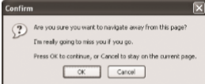

^9^ Arm you stra you want to	ffD"* tH» page?
rtarMlygortQtttnissyouf you9〇.
Press 〇K to continue, or C«ncei to on the current page.
为了显示这个弹出对话框，必须将event.returnvalue的值设置为要显示给用户的字符串（对 IE及Fiefox而言），同时作为函数的值返回（对Safari和Chrome而言），如下面的例子所示。
```
EventUtil.addHandler(window, "beforeunload"# function(event){
event = Ever.tUtil.getEvent (event);
var message = "I'm really going to miss you if you go."?
event.returnValue = message;
return message?
));
```

IE和Firefox、Safari和Chrome都支持beforeunload事件，也都会弹出这个对话框询问用户是否 真想离开。Opera 11及之前的版本不支持beforeunload事件。
##### 3. DOMContentLoaded 事件
如前所述，window的load事件会在页面中的一切都加载完毕时触发，但这个过程可能会因为要 加载的外部资源过多而颇费周折。而DOMContentLoaded事件则在形成完整的DOM树之后就会触发, 不理会图像、JavaScript文件、CSS文件或其他资源是否已经下载完毕。与load事件不同， DOMContentLoaded支持在页面K载的早期添加事件处理程序，这也就意味着用户能够尽早地与页面 进行交互。

要处理DOMContentLoaded事件，可以为document或window添加相应的事件处理程序（尽管 这个事件会行泡到window,但它的目标实际上是document)。来看下面的例子。
```
HventUtil.addHandler(document, "DOMContentLoaded", function(event){ alert{^Content loaded");
});
```
DOMContentLoaded事件对象不会提供仟何额外的信息（其target属性是document )。

IE9+、Firefox、Chrome、Safari 3.1+和 Opera 9+都支持 DOMContentLoaded 事件，通常这个事件 既可以添加事件处理程序，也可以执行其他DOM操作。这个事件始终都会在load事件之前触发。

对于不支持DOMContentLoaded的浏览器，我们建议在页面加载期间设®—个时间为0毫秒的超 时调用，如下面的例子所示。
```
setTimeouttfunction(){
//在此添加事件处汊权序 }, 〇);
```
这段代码的实际意思就是：“在当前JavaScript处理完成后立即运行这个函数，在页面下载和构建 期间，只有一个JavaScript处理过程，因此超时调用会在该过程结束时立即触发。至于这个时间与 DOMContentLoaded被触发的时间能否同步，主要还是取决于用户使用的浏览器和页面中的其他代码。 为了确保这个方法有效，必须将其作为页面中的第一个超时调用;即便如此，也还是无法保证在所有环 境中该超时调用一定会早于load事件被触发。

#### 4.readystatechonge 事件
IE为DOM文档中的某些部分提供了 readystatechange事件。这个事件的目的是提供与文档或 元索的加载状态有关的信息，但这个亊件的行为有时候也很难预料。支持readystatechange事件的 每个对象都有一个readyState属性，可能包含下列5个值中的一个。
- [ ] uninitialized (未初始化）：对象存在但尚未初始化。
- [ ]loading (正在加载)：对象正在加载数据。
- [ ]loaded (加载完毕）：对象加载数据完成。
- [ ]interactive (交互）：可以操作对象了，fll还没有完全加载。
- [ ]complete (完成）：对象已经加载完毕。


这些状态看起来很直观，但并非所有对象都会经历readyState的这几个阶段。换句话说，如果某 个阶段不适用某个对象，则该对象完全可能跳过该阶段;并没有规定哪个阶段适用于哪个对象。显然， 这意味着readystatechange事件经常会少丁*4次，而readyState属性的值也不总是连续的。

对于 document 而言，值为-interactive*•的 readyState 会在与 DOMContentLoaded 大致相 同的时刻触发readystatsechange ’ff件。此时，DOM树已经加载完毕，可以安全地操作它了，因此就 会进人交互（interactive)阶段。但与此同时，图像及其他外部文件不一定可用。下面来看一段处理 readystatechange 亊件的代码。
```
EventUti1.addHandler(document, "readystatechange*, function(event){ if (document.readyState == "interactive"){ alert{"Content loaded*);
)
});
```
这个事件的event对象不会提供任何信息，也没有目标对象。
在与load事件一起使用时，无法预测两个事件触发的先后顺序。在包含较多或较大的外部资源的 页面中，会在load事件触发之前先进入交互阶段;而在包含较少或较小的外部资源的页面中，则很难 说readystatechange事件会发生在load事件前面。

让问题变得更复杂的是，交互阶段可能会早于也可能会晚于完成阶段出现，无法确保顺序。在包含 较多外部资源的页面中，交互阶段更有可能早r完成阶段出现;而在页面屮包含较少外部资源的情况下, 完成阶段先于交互阶段出现的可能性更大。W此，为了尽可能抢到先机，有必要同时检测交互和完成阶 段，如下面的例子所示。
```
EventUtil.addHandler(document, ■readystatechange", function(event){
if (document.readyState == "interactive" I I document.readyState == "complete"){ EventUtil.removeHandler{document, "readystatechange", arguments.callee); alert("Content loaded")?
}
});
```
对于上面的代码来说，1 readystatechange事件触发时，会检测document.readyState的值， 看当前是否已经进人交互阶段或完成阶段。如果是，则移除相应的事件处理程序以免在其他阶段再执行。 注意，由于事件处理程序使用的是匿名函数，W此这里使用了 arguments.callee来引用该函数。然 后，会显示一个警告框，说明内容已经加载完毕。这样编写代码可以达到与使用DOMContentLoacied 十分相近的效果。

支持 readystatechange 事件的浏览器有 IE、Firfox 和 Opera。
虽然使用readystatechange可以十分近似地模拟DOMCont^entLoaded事件， 但它们本质上还是不同的。在不同两面中，load事件与readystatechange事件并 不能保证以相同的顺序触发。

另外，`<script> `(在 IE 和 Opera 屮）和`<link> `(仅 IE 中）儿素也会触发 readystatechange 亊件，可以用来确定外部的JavaScript和CSS文件是杏已经加载完成。与在其他浏览器中一样，除非把 动态创建的元桌添加到页面中，否则浏览器不会开始下载外部资源。基于元素触发的 readysLatechange事件也存在冋样的问题，即readyState属性无论等于■■loaded•还是 "complete"都可以表示资源已经可用。有时候,readyState会停在"loaded"阶段而永远不会“完成”; 有时候，又会跳过"loaded"阶段而直接“完成”。于是，还耑要像对待document—样采取相同的编码 方式。例如，下面展示了一段加载外部JavaScript文件的代码。
```
Rvencutil.addHandior(window, "load”， function{){ var script = document.crcateElemcnt("script*);
BventUtil•addHandler(script, ureadystatechangeM, function(event){ event s： EventUtil. getEvent (event); var target a EventUtil.getTarget(event);
if (target.readyState == "loaded" I I target.readyState =s "complete"){
EventUtil.removeHandler(target, nreadystatechangen, arguznents. callee); alert("Script Loaded");
>);
script.src = "example.js"; document.body.appendChild(script);
}>;
```
这个例了为新创建的点指定了一个少件处理程序。事件的目标是该节点本身，因此当 触发readystatechange #件时，要检测Q标的readyState属性是不是等于” loaded"或 "complete"。如果进人了其屮仟何一个阶段，则移除亊件处理程序（以防止被执行两次），并艰示个 替告框。与此同时，就可以执行已经加载完毕的外部文件中的函数了。

同样的编码方式也适用于通过`<div>`元素加载CSS文件的情况，如下面的例子所示。
```
EventUtil.addHandler(window, "load", function0{ var link = document .createElement ("lir.k"); link, type = ntext/css*'; link.rel» "stylesheet";
EventUtil.addHandler(script/ nreadystatechangeH, function(event){ event * EventUtil.getEvent(event); var target « BventUtil.getTarget(event);
if (target.readyState == "loaded" || tairffet-zreeuSyStute 簏鍵	{
EventUtil.rexaoveHandler(target, nreadyatat:echangew/ arsrumenta. callee); alert ("CSS I^oaded”;
)
});
link.href = "example.css";
document.gGtElementsByTagName{"head*'} [0] .appendChild(link);
```
同样，最t要的是要一并检测readyState的两个状态，并在调用了一次事件处理程序后就将其移除。

#### 5.pafireshow 和 pagehide 事件
Firefox和Opera有一个特性，名叫“往返缓存”（back-forward cache，或bfcaclie)，可以在用户使 用浏览器的“后退”和“前进”按钮时加快页面的转换速度。这个缓存中不仅保存着页面数据，还保存 了 DOM和JavaScript的状态;实际上是将整个页面都保存在了内存1。如果页面位于bfcache中，那么 再次打开该页面时就不会触发load事件。尽管由于内存中保存了整个页面的状态，不触发load事件 也不应该会导致什么问题，但为丫更形象地说明bfcache的行为，Firefox还是提供丫一些新事件。

第一个事件就是pageshcw,这个事件在页面显示时触发，无论该页面是否来D bfcache。在電新加 载的页面中’ pageshow会在load事件触发后触发;而对于bfcache中的页面，pageshow会在页面状 态完全恢复的那一刻触发。另外要注意的是，虽然这个事件的目标是document,但必须将其事件处理 程序添加到window。来肴下面的例子。
```
(function()(
var showCount * 0?
EventUtil.aadHandler(window, "load", function(){ alert("Load fired");
EventUtil.addHandier(window, "pagcshow", functionU{ showCount+ + ;
alert("Show has been fired " + showCount + " times.");
));
no;
```
这个例子使用丫私有作用域，以防止变t showCount进人全局作用域。当页面首次加载完成时， showCount的值为0。此后，每当触发pageshow事件，showCount的值就会递增并通过審告框5i示 出来。如果你在离开包含以上代码的页面之应，乂单击“后退”按钮返回该页面，就会看到showCount 每次递增的值。这是因为该变量的状态，乃至整个页面的状态，都被保存在了内存中，当你返回这个页 面时，它们的状态得到了恢复。如果你单右了浏览器的“刷新”按钮，那么shovcount的值就会被重 置为〇,因为页面B经完全重新加载了。

除f通常的属性之外，pageshow事件的event对象还包含一个名为persisted的布尔值属性。 如果页面被保存在了 bfcache中，则这个属性的值为true;否则，这个属性的值为false。可以像下面 这样在事件处理程序中检测这个域性C
```
(function{){
var showCount = 0?
EventUtil.addHandier(window, Mload\ function(){
alerc('Load fired");
));
EventUtil.addHandier(window, "pageshow", function(){
showCount++;
&lert(nShow has been	showCount +
H times. Persisted? " + event.persisted);
));
>)();
```
通过检测persisted M性，就可以根据页面在bfcaehe中的状态来确定是否需要采取丼他操作。
与pageshow亊件对应的是pagehide事件，该事件会在浏览器卸载页面的时候触发，而且是在 unload事件之前触发。*?pageshow車件--样，pagehide在document:上面触发，但其事件处理程 序必须要添加到window对象。这个事件的event对象也包含persisted属性，不过其用途稍有不同。 来肴下面的例子。
```
EventUtil.addHandler(window, "pagohidc", function(event){
alert("Hiding. Persisted? • + event.persisted);
};
```
有时候，町能需要在pagohide事件触发时根据persisted的值采取不同的操作。对于pageshow 事件，如果而是从bfcache中加载的，那么persisted的值就是true;对于pagehide事件，如果 页面在卸载之后会被保存在bfcache中，那么persisted的值也会被设置为true。因此，当第一次触 发pageshow时，persisted的值一定是false，而在第一次触发pagehide时，persisted就会变 成true (除非页面不会被保存在bfcache中)c
支持 pageshow 和 pagehide 事件的浏览器有 Firefox、Safari 5+、Chrome 和 Opera。IE9 及之前版 本不支持这两个事件。

指定了 onunload事件处理程序的页面会被自动排除在fcfcache之外，即使事件 处理程序是空的d原因在于，onunload最常用于撤销在onload令所执行的操作， 而跳过onload后再次显示页面很可能就会导致页面不正常。
#### 6. hashchange 事件
HTML5新增了 haschange亊件，以便在URL的參数列表（及URL中号后面的所有字符串） 发生变化时通知开发人员。之所以新增这个事件，是因为在Ajax炖用屮，开发人M经常要利用URL参 数列来保存状态或导航信息。

必须要把hashchange事件处理程序添加给window对象，然后URL参数列表只要变化就会调用♦ 它。此时的event对象应该额外包含W个属性：oldURL和newURL。这两个属性分别保存着参数列表 变化前后的完整URL。例如：
```
EventUtil.addHandier(window, "hashchange", function(evont){
alert (*01d URJj： " ^ event. oldURL + "\nNew URL: " + event .newURL);
});
HashChangeEventExampleOl. htm
支持 haschange 事件的浏览器有 IE8+、Firefox3*6+、Safari 5+、Chrome 和 Opera 10.6+。在这些 浏览然中，只有F"irefox6+、Chrome和Opera支持o::dU3L和newURL M性。为此，最好是使用location 对象来确定当前的参数列表。
EventUtil.addHandler(window, "hashchange", function(event){ alert("Current hash: " + location.hash);
));
```
使用以下代码可以检测浏览器是否支持haschange事件:
`var isSupported = (• onhashchange" in window) ; //这里有 bug`
如果IE8是在IE7文档校式下运行，即使功能无效它也会返回true。为解决这个问题，可以使用 以下这个更稳妥的检测方式：
#### 7. 13.4.8设备事件
智能手机和平板电脑的普及，为用户与浏览器交互引人了一种新的方式,而一类新事件也应运而生。 设备亊件（device event)可以让开发人员确定用户在怎样使用设备。W3C从2011年开始着手制定-份 关'丁*设备事件的[新草案]（http://dev.w3.org/gco/api/spec-source"〇rientation.html )，以涵盖不断增长的设备 类型并为它们定义相关的事件。本节会同时讨论这份草案中涉及的API和特定于浏览器开发商的事件。

苹果公司为移动Safari中添加了 orientationchange事件，以便开发人员能够确定用户何时将设 备由横向査看模式切换为纵向丧肴模式。移动Safari的window, orientation属性巾可能包含3个值: 0表示肖像模式，9C表示向左旋转的横向模式（“主屏幕”按钮在右侧），-90表示向右旋转的横向模 式（“主屏幕”按钮在左侧相关文档中还提到-个值，即180表示iPhone头朝下;但这种模式至今 尚未得到支持。阳13-10展示了 window.orientation的每个值的含义。

只要用户改变了设备的査宥模式，就会触发orientationchange事件。此时的event对象不包 含任何有价值的信息，因为唯一相关的信息可以通过window, orientation访问到。下面是使用这个 事件的典型示例。
```
var isSupported = ("onhashchange" in window) && (document.documentMode === undefined I I document.documentMode >7);
EventUtil.addHandler(window, "load*, function(event){
var div = document.getElementById("myDiv");
div.innerHTML = "Current orientation is " + window.orientation;
EventUtil.addHandler(window, "orientationchange", function(event){ div.innerHTML = "Current orientation is "	window.orientation?
));
}};
```
在这个例子中，与触发load事件时会显示最初的方向信息。然后，添加丫处理orientafcionchange 事件的处理程序。只要发生这个事件，就会有表示新方向的信息更新页面中的消息。

所有 iOS 设备都支持 orientationchange 亊件和 window, orientation 属性。
由于可以将orientationchange看成window事件，所以也可以通过指定
`<lD〇dy>`元素的onorientationchange特性来指定事件处理程序。
##### 2. MozOrientation 事件
Firefox 3.6为检测设备的方向引人广.斗名力MozOrientatior■的新事件。（前缀Moz表7TC这是特 定于浏览器开发商的事件，不是标准事件。）当设备的加速计检测到设备方向改变时，就会触发这个事 件。但这个事件与i〇S中的orientationchange审件不同，该事件只能提供一个平面的方向变化0由 于MozOrientation事件是在window对象h触发的，所以可以使用以下代码来处理。
```
EventUtil.addHandler(window, "MozOrientation() =function(event){
//响应事件
});
```
此时的event对象包含三个属性：x、y和z。这几个属性的值都介丁• 1到-1之间，表示不间坐标 轴上的方向=在静止状态下，x值为0, y值为0, Z值为I (表示设备处于竖直状态)。如果设备向右倾 斜，x值会减小;反之，句左倾斜，x值会增大。类似地，如果设备向远离用户的方向倾斜，y值会减 小，向接近用户的方向倾斜，y值会增大。z轴检测垂直加速度度，1表示静止不动，在设备移动时值 会减小。（失《状态下值为0。）以K是输出这三个值的一个简单的例P。
```
EventUtil.addHandler(window, "M〇2〇rientation", function(event){ var output = document.getElementBylcU"output");
output. innerHTML = "X=* + event. x + ", Y=" + event .y + ", Z=" -r event. z +”<br>__?
});
```
只有带加速H•的设备才支持 MozOrientation 事件，包括 Macbook、Lenovo Thinkpad、Windows Mobile和Android设备。请大家注意，这是一个实验性API,将来可能会变（可能会被其他事件取代)。 3. deviceorientation 事件
本质上，DcviccOrientation Event规范定义的 deviceorientation 事件与 MozOrientation 事件类 似。它也是在加速计检测到设备方向变化时在window对象上触发，而.ft具布与MozOrientation事件 相閻的支持限制。+过，deviceorientation #件的意阁是告诉开发人员设备在空间中朝向哪儿，而 不是如何移动。

设备在三维空间中是靠x、_v和z轴来定位的。当设备静止放在水平表面上时，这三个值都是〇。尤 轴方向是从左往右，>>轴方向是从下往上，Z轴方向是从后往前（参见图13-11 )。

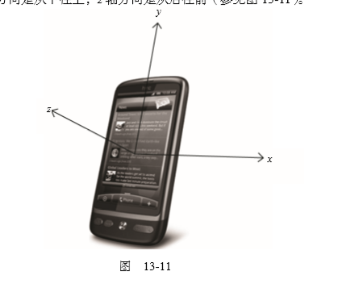

触发deviceorientation事件时，事件对象中包含若每个轴相对于设备諍止状态下发生变化的信
息。事件对象包含以下5个属性


- [ ]alpha:在围绕2轴旋转时（即左右旋转时),y轴的度数差;是-个介于0到360之间的浮点数。
- [ ]beta:在围绕^轴旋转时（即前后旋转时),z轴的度数差;是-个介于-180到180之间的浮点数。
- [ ]gama:在围绕y轴旋转时（EP扭转设备时)，z轴的度数差;是一个介于_卯到卯之间的浮点数。
absolute:布尔值，表示设备是否返间一个绝对值。
- [ ]  compassCalibrated:布尔值，表不设备的指南针是否校准过。

图13-12是alpha、beta和gamma值含义的示意图。

下面是一个输出alpha、beta和gamma值的例子。
```
EventUtil.addHandler (window# *deviceorientaf.ionB, function (event) {
var output = document .getElement-Byld ("output");
output.innerHTML = "Alpha=" + evenc.alpha + ", Beta=" + event.beta +
Gammas'* 十 event • gamma + "<br>";
});
```
通过这些信息，坷以响应设备的方向，重新排列或修改屏幕上的元素。要响应设备方向的改变而旋 转元素，可以参考如下代码。
```
EventUtil.addHandler(window# "deviceorientation", function(event){ var arrow = document.getElementById("arrow");
arrow.style.webkitTrarisforra = "rotate(" + Math.round{event.alpha) + "deg)•;
});
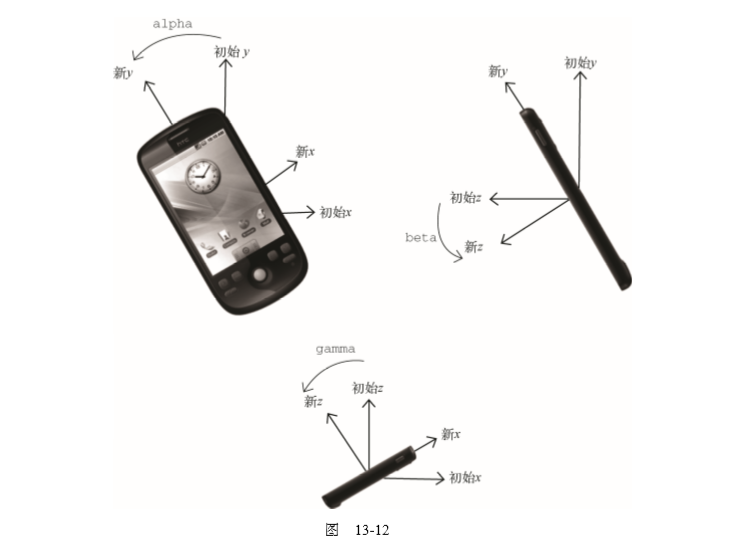

这个例子只能在移动WebKit浏览器中运行，因为它使用了专有的webkitTransform属性（即CSS 标准属性transform的临时版)。元素“arrow”会随着event.alpha值的变化而旋转，给人一种指南 针的感觉。为f保证旋转平拊，这里的CSS3变换使了舍入之后的值。
到 2011 年，支持 deviceorientation 事件的浏览器有 iOS4.2+中的 Safari、Chrome 和 Android版
WebKit。
#### 4. devicemotion 事件
DeviceOrientation Event规范还定义广•个devicemotion事件。这个事件是要告诉开发人员设备 什么时候移动，而不仅仅是设备方向如何改变。例如，通过devicemotion能够检测到设备是不是正在 往下掉，或者是不屉被走着的人命在f-电。

触发devicemotion事件时，事件对象包含以F属性。
- [ ] acceleration: —个包含x、y和z属性的对象，在不考虑重力的情况下，告诉你在每个方向 h的加速度。
- [ ]accelerationlncludingGravity： •个包含x、y和z M性的对象，在考虑z轴自然重力加 速度的怡况下，告诉你在每个方向上的加速度。
- [ ]interval:以毫秒表7K的时间值，必须在另—*个devicemotdon事件触发前传人。这个值在每 个枣件中应该足-•个常M。

- [ ]  rotationRate： 一个包含表示方向的alpha、beta和gamma属性的对象。

如果读取不到 acceleration、accelerationincludingGravity 和 rotationRate 值，则它们 的值为null。因此，在使用这H个属性之前，应该先检测确定它们的值不是null。例如：
```
EventUtil.addHandler(window, "devicemotion", function(event){
var output = document.getElenentById("output");
if (event.rotationRate »== null){
output.innerHTML ♦= "Alpha-" + event.rotationRate.alpha ♦ •• Betas" +
event.rotationRate.beta + •• Gamma=• +
event.rotationRate.gamma?
)
});
```
与 deviceorientation 事件类似，只有 iOS 4.2+中的 Safari、Chrome 和 Android 版 WebKit 实现丫 devicemotion 事件。
##### 13.4.9触摸与手势事件
iOS版Safari为了向开发人员传达一些特殊信息，新增广•，专有事件。因为iOS设备既没有鼠标 也没有键盘，所以在为移动Safari开发交互性N页时，常规的鼠标和键盘事件根本不够用。随着Android 中的WebKit的加人，很多这样的专有事件变成了事实标准，导致W3C开始制定Touch Events规范（参 见 https://dvcs.w3.org/hg/webevents/raw-file/tip/touchevents.html )。以下介绍的事件只针对触摸设备。
##### 1. 触摸事件
包含iOS 2.0软件的iPhone 3G发布时，也包含丫 -个新版本的Safari浏览器。这款新的移动Safari 提供了一些与触摸（touch)操作相关的新事件。后来，Android上的浏览器也实现了相同的事件。触摸 事件会在用户手指放在屏幕上面时、在屏幕上滑动时或从屏幕上移开时触发。具体来说，有以下几个触 摸事件。
- touchstart:当手指触摸屏幕时触发;即使已经有一个手指放在了屏幕上也会触发。
- touchmove: ^手指在屏幕上滑动时连续地触发。在这个事件发牛.期间，调用preventDefault (> 可以阻止滚动。
口 toucher.d:当手指从屏幕上移开时触发。
- touchcancel:当系统停止跟踪触摸时触发。关于此#件的确切触发时间，文档中没有明确说明。 上面这几个事件都会冒泡，也都可以取消。虽然这些触摸亊件没有在DOM规范中定义，但它们却
是以兼容DOM的方式实现的。因此，每个触摸事件的event对象都提供了在鼠标事件中常见的属性：bubbles、cancelable、view、clientX、clientY、screenX、screenY、detai1、altKey、shiftKey、 ctrlKey 和 metaKey。

除了常见的DOM属性外，触摸事件还包含下列三个用于跟踪触摸的属性。
- touches :表示当前跟踪的触摸操作的Touch对象的数组。
- targetTouchs:特定于事件H标的Touch对象的数组。
- changeTouches:表示上次触摸以来发生f什么改变的Touch对象的数组。

每个Touch对象包含下列属性。

- clientx:触摸0标在视口中的x坐标。
- clientY:触摸目标在视I丨中的y坐标。
- identifier:标识触摸的唯一1D。
- pagex:触摸目标在页面中的坐标。
- pageY:触摸目标在页面中的坐标。
- screenX:触摸目标在屏幕中的坐标。
-  screenY:触摸H标在屏幕中的少坐标。
- target:触摸的DOM节点目标。
使用这些属性可以跟踪用户对屏幕的触摸操作。来看下面的例子。
```
function handleTouchEvent(event){
//只跟餘一次触旗
if (event.touches.length == 1){
var output = document.getElementByld("output*); switch(event.type){
case "touchstart":
output.innerHTML = "Touch started (" + event.touches[0].clientx + ",** + event.touches[0] .clientY + ")”;
break;
case "touchend*:
output.innerHTML += "<br>Touch ended (_ +
event.changedTouches[0].clientx + ",* + event .changedTouches [0] .clientY +■")";
break;
case "touchmove"：
event .preventDefault {);	//阻止滚动
output.innerHTML "<br>Touch moved (■ +
event.changedToucheslO].clicntX + •," + event.changedTouches(0].clientY + *)";
break;
Eventlltil.addHandler{document, "touchstart", handleTouchEvent); EventUtil.addHandler(document, "touchend", handleTouchEvent); EventUcil.addHandler(document, "touchmove", handleTouchEvent)?
```
以上代码会跟踪屏幕上发生的一次触摸操作。为简单起见，只会在有一次活动触摸操作的情况下输 出信息。肖touchstart事件发生时，会将触摸的位置信息输出到<(3^>兀素中。当touchmove事件 发生时，会取消其默认行为，阻止滚动（触摸移动的畎认行为是滚动页面），然后输出触摸操作的变化 信息。而toucherua事件则会输出有关触摸操作的最终信息。注意，在touchend事件发生时，touches 集合中就没有任何Touch对象了，因为不存在活动的触摸操作;此时，就必须转而使用changeTouchs 集合。

这些事件会在文档的所有元素上面触发，因而可以分别操作页面的不同部分。在触摸屏幕上的元索 时，这些事件（包括鼠标事件）发生的顺序如下：

touchstart

mouseover

mousemove ( 一次）

mousedown

mouseup

click

touchend

 ##### 2.支持触摸事件的浏览器
 包括iOS版Safari、Android版WebKit、bada版Dolfin、OS6+中的BhckBerry WebKit、Opera Mobile 10.1+和LG专有OS中的Phantom浏览器。H前只有iOS版Safari支持多点触摸。 桌面版Firefox 6+和Chrome也支持触摸事件。

iOS2.0中的Safari还引人了一组手势事件。当两个T-指触摸屏藉时就会产生手势，手势通常会改变 M示项的大小，或者旋转显示项。有三个手势事件，分别介绍如下。

gesturestart:当一个手指已经按在屏幕上而另一个手指乂触摸屏幕时触发。
口 gesturechange:当触摸屏幕的任何一个手指的位置发生变化时触发。
gestureend:当任何一个手指从屏幕上面移开时触发。

只有两个手指都触摸到事件的接收容器时才会触发这些事件。在一个元素上设置事件处理程序，意 味着两个手指必须同时位于该元索的范围之内，才能触发手势事件（这个元素就是H标)。由于这件事 件冒泡，所以将事件处理程序放在文档上也可以处理所冇手势事件。此时，事件的目标就是两个手指都 位于其范围内的那个元素。

触摸事件和手势事件之间存在某种关系。当一个手指放在屏幕上时，会触发touchstart事件。如 果另一个手指又放在了W幕上，则会先触发gesturestart事件，随后触发基于该手指的touchstart 事件。如果一个或两个f•指在屏幕丨:滑动，将会触发gesturechange事件。但只要有个手指移开， 就会触发gestureend事件，紧接着又会触发基于该手指的touchend事件。
与触摸事件一样，每个手势事件的event对象都包含着标准的鼠标事件属性：bubbles、 cancelable、 view、 clientX、 clientY、 screenX、 screenY、 detail、 altKey、 shiftKey、 ctrlKey和metaKey。此外，还包含两个额外的属性：rotation和scale。其中，rotation属性表 示手指变化引起的旋转角度，负值表示逆时针旋转，正值表示顺时针旋转（该值从0开始)。而scale 属性表示两个手指间距离的变化情况（例如向内收缩会缩短距离）;这个值从丨开始，并随距离拉大而 增长，随距离缩短而减小。

下面是使用手势事件的一个示例。
```
function handleGestureBvenc(event){
var output = document.getElementById("output*); switch{evenc.type){
case "gesturestart*：
output.innerHTML = "Gesture started (rotation? + event.rotation + scale=" + event.scale + ")■;
break;
case "gestureend*:
output.innerHTML += *<br>Gesture ended (rotations" + event.rotation + scale=” + event.scale + ")";
break;
case "gesturechange":
output.innerHTML += "<br>Gesture changed {rotations" + event.rotation +
*,scale=" + event.scale + _)*;
break;
document.addEventListener{"gesturestart", handleGestureEvent, false); document.addEventListener{"gestureend", handleGestureEvent, false); document.addEventListener(■gesturechange■, handleGestureEvent, false);
```
与前面演示触摸事件的例子一样，这里的代码只是将每个亊件都关联到同一个函数中，然后通过该 碱数输出每个亊件的相关信息。

勒摸事件也会返回rotation和scale属性，但这两个属性只会在两个手指与 屏幕保持接触时才会发生变化。一般来说，使用基于两个手指的手势事件，要比管理 触摸事件中的所有交互要容易得多。

## 13.5内存和性能
由于事件处理程序可以为现代Web应用程序提供交互能力，因此许多开发人员会不分青红阜白地 向页面中添加大贵的处理程序。在创建GUI的语言（如C# )中，为GUI中的每个按钮添加一个onclick 亊件处理程序是司空见惯的事，而且这样做也不会导致什么问题。可是在JavaScript中，添加到页面上 的事件处理程序数量将直接关系到页面的整体运行性能。导致这一问题的原因是多方面的。首先，每个 函数都是对象，都会占用内存;内存中的对象越多，性能就越差。其次，必须事先指定所有事件处理程 序而导致的DOM访问次数，会延迟整个页面的交互就绪时间。事实上，从如何利用好事件处理程序的 角度出发，还是有一些方法能够提升性能的。
### 13.5.1事件委托
对“事件处理程序过多”问题的解决方案就是亊件委托。事件委托利用了事件冒泡，只指定一个亊 件处理程序，就可以管理某一类型的所有事件。例如，click事件会一直冒泡到document层次。也就 是说，我们可以为整个页面指定一个onclick事件处理程序，而不必给每个可单击的元索分别添加亊 件处理程序。以下面的HTML代码为例。
```
<ul id="myLinks">
<li id="goSomewhere*>Go somewhere</li>
<li id="doSomething">Do something</li>
<li id="sayHin>Say hi</li>
</ul>
```
其中包含3个被单击后会行操作的列表项。按照传统的做法，需要像下面这样为它们添加3个事 件处理程序。

```
var iteml = document.getElementByld("goSomewhere"); var item2 - document.getElementById{*doSomething"); var item3 = document. getElementByld (*' sayHi ■) ?
EventUtil.addHandler(iteml* "click", function(event){ location.href = "http://www.wrox.com";
));
EventUtil.addHandler(item2/ "click"x function(evenc){ document.title = "I changed the document's title";
));
EventUtil.addHandler(item3, "click*, function(event){ alert("hi");
));
```
如果在一个复杂的Web应用程序中，对所有可单击的元素都采用这种方式，那么结果就会有数不 清的代码用于添加事件处理程序。此时，可以利用事件委托技术解决这个问題。使用事件委托，只需在 DOM树中尽量最高的层次上添加一个事件处理程序，如下面的例子所示。
```
var list = document.getElementById(■myLinks");
EventUtil.addHandler(list, "click", function(event){
event = EventUtil.getEvent(event);
var target = EventUtil.getTarget(event);
switch(target.id){
case "doSomething":
document.title = "I changed the document's title*; break;
case "goSoroewhere"：
location.href = ■http://www.wrox.com"; break;
case ■sayHi":
alert("hi"); break;
}
));
```
在这段代码里，我们使用事件委托只为<〇>1>元索添加了一个onclick事件处理程序。由于所有列 表项都是这个元素的子节点，而且它们的事件会胃泡，所以单击事件最终会被这个函数处理。我们知道, 事件目标是被单击的列表项，故而可以通过检测id属性来决定采取适当的操作。与前面未使用事件委 托的代码比一比，会发现这段代码的事前消耗更低，因为只取得了一个D0M元素，只添加了一个事件 处理程序。虽然对用户来说最终的结果相同，但这种技术需要占用的内存更少。所有用到按钮的事件（多 数鼠标事件和键盘事件）都适合采用事件委托技术。

如果可行的话，也可以考虑为document对象添加一个事件处理程序，用以处理页面上发生的某种 特定类型的事件。这样做与采取传统的做法相比具有如下优点。

- [ ]  document对象很快就可以访问，而H.可以在页面生命周期的任何时点上为它添加事件处理程序 (无等待DOMContentLoaded或load事件)。换句话说，只要可年击的兀素呈现在页面上， 就可以立即具备适当的功能。
- [ ] 在页面中设S事件处理程序所需的时间更少。只添加一个事件处理程序所需的DOM引用更少， 所花的时间也更少。
- [ ] 整个页面占用的内存空间更少，能够提升整体性能。
一敢适合采用水件委托技术的事件包括click、mousedown、mouseup、keyt3own、keyup和keypress。 虽然mouseover和mouseout事件也tf泡，但要适3处理它们并不容易，而且经常箭要计算元素的位贺。 (因为当鼠标从一个元素移到其子节点时，或者当鼠标移出该元素时’都会触发mouseout事件。）
### 13.5.2移除事件处理程序
每将亊件处理程序指定给元索时，运行中的浏览器代码与支持贞面交If的JavaScript代码之间就 会建立一个连接。这种连接越多，页面执行起来就越慢。如前所述，吋以采用事件委托技术，限制建立 的连接数M。另外，在不需要的时候移除事件处理程序，也是解决这个问题的一种方案。内存中留有那 些过时不用的“空事件处理程序"（dangling event handler),也是造成Web应用程序内存与性能问题的 主要原因。

在两种情况下，可能会造成上述问题。第一种情况就足从文档中移除带有事件处理程序的元素时。 这可能是通过纯粹的DOM操作，例如使用removeChild()和replaceChild()方法，但更多地是发 生在使用irmerHTML替换页面中某一部分的时候。如果带冇亊件处理程序的元索被irmerHTML删除 了，那么原来添加到元素中的亊件处理程序极有n丨能无法被当作垃圾回收。来看下面的例子。
```
<div id="myDiv">
<inpuc. cype=*butcon, values "Click Me" id="nYBtn">
</div>
<script type=”text/javascript">
var btn = document.getElementByTd<*inyBtn”; btn.onclick = function(){
//先执行某些操作
document.getEXen\entById{ "rryDiv*) .innerHTML = "Processing. . ."; //麻领了！
};
</script>
```
这里，有一个按钮被包含ft`<div>`元素中。为避免双击，单if?这个按钮时就将按钮移除并替换成一 条消息;这是网站设计中非常流行的一种做法。但问题在于，当按钮被从页面中移除时，它还带着一个 事件处理程序呢。在`<div>`元素上设置innerHTML可以把按钮移走，但事件处理程序仍然弓按钮保持 着引用关系。有的浏览器（尤其是1E)在这种情况下不会作出恰出地处理，它们很有可能会将对元素和 对事件处理程序的引用都保存在内存中。如果你知道某个元素即将被移除，那么最好手丁.移除事件处理 程序，如下面的例子所示。
```
<div id="myDiv>
<input Cype-"button" value="Click Me" id=*myBtn">
</div>
〈script typ€=wtext/javascript">
var btn = document.getElementById("myEtn");
btn.onclick = function{){
//先执行茱些操作
btn.onclick » null;	//移汾事件处攻祖序
document.getElementById{"myDiv").innerHTML = "Processing..."?
};
</script>
```
在此，我们在设贾`<div>`的innerHTML属性之前，先移除了按钮的事件处理程序。这样就确保了 内存可以被再次利用，而从DOM中移除按钮也做到了干净利索。

注意，在事件处理程序中删除按钮也能阻止事件冒泡。目标元素在文杜中是事件冒泡的前提。

采用事件委托也有助于解决这个问题。如果事先知道将来有可能使用innerHTML 替换掉页面中的某一部分，那么就可以不直接把事件处理程序添加到该部分的元素 中。而通过把事件处理程序指定給较高层次的元素，同样能够处理该区域中的事件。

导致“空事件处理程序”的另一种情况，就是卸栽页面的时候。毫不奇怪，IE8及更早版本在这种 情况下依然是问题最多的浏览器，尽管其他浏览器或多或少也有类似的问题。如果在页面被卸载之前没 冇清理干净事件处理程序，那它们就会滞留在内存中。每次加载完页面再卸载页面时（可能是在两个页 面间来回切换，也可以是单击了 “刷新”按钮)，内存中滞留的对象数B就会增加，因为事件处理程序 占用的内存并没有被释放。

一般来说，最好的做法是在页面卸载之前,先通过ommload事件处理程序移除所有事件处理程序。 在此，事件委托技术再次表现出它的优势需要跟踪的事件处理程序越少，移除它们就越容易。对这 种类似撤销的操作，我们可以把它想象成：只要是通过onload事件处理程序添加的东西，最后都要通 过onunload事件处理程序将它们移除。

不要忘了，使用onunload事件处理程序意味着页面不会被缓存在bfcache中。
如果你在意这个问題，那么就只能在IE中通过onunload来移除事件处理程序了。
## 13.6模拟事件
事件，就是网页中某个特别值得关注的瞬间。事件经常由用户操作或通过其他浏览器功能来触发。 但很少有人知道，也可以使用JavaScript在任意时刻来触发特定的事件，而此时的事件就如同浏览器创 建的事件一样。也就是说，这些事件该冒泡还会冒泡，而且照样能够导致浏览器执行已经指定的处理它 们的事件处理程序。在测试Web应用程序，模拟触发事件是一种极其有用的技术。DOM2级规范为此 规定了模拟特定事件的方式，IE9、Opera、Firefox、Chrome和Safari都支持这种方式。IE有它自己模拟 事件的方式。

### 1.DOM中的事件模拟
可以在document对象上使用createEvent ()方法创建event对象。这个方法接收一个参数，即 表示要创建的事件类型的字符串。在DOM2级中，所有这些字符串都使用英文复数形式，而在DOM3
级屮都变成了单数。这个字符中可以是下列儿字符串之一。
- UIEvents: —般化的U丨事件。鼠标事件和键盘亊件都继承0 UI事件。DOM3级屮是UIEvent。
- MouseKvents: 一■般化的鼠标事件。DOM3 级中是 MouseEvent。
- MutationEvents： 一般化的 DOM 变动事件。DOM3 级中是 MutationEvent。
- HTMLEvents: —般化的HTML事件。没有对应的DOM3级事件（HTML事件被分散到其他类 别中)。

要注意的是，“DOM2级亊件”并没有专I'j规定键盘事件，后来的“DOM3级事件”中才正式将其 作为一种亨件给出规定。IE9是B前唯一支持DOM3级键盘事件的浏览器。不过，在其他浏览器中，在 现有方法的基础上，可以通过几种方式來模拟键盘水件。

在创建了 event对象之后，还需要使用Lj事件有关的倌息对其进行初始化。每种类型的evendif 象都有一个特殊的方法，为它传人适肖的数据就可以初始化该event对象。不同类型的这个方法的名 字也不相问，具体要取决丁- createEvent ()中使用的参数。

模拟事件的域后一步就是触发事件。这一步盅要使用dispatchEventO方法，所有支持事件的 DOM节点都支持这个方法。调用dispatchEventU方法时，需要传人.个参数，即表示要触发事件 的event对象。触发亊件之后，该來件就挤身“宵方事件”之列了，W而能够照样3泡并引发相应事 件处理程序的执行。
### 2.模拟鼠标事件
创建新的鼠标亊件对象并为其指定必要的信息，就可以模拟鼠标事件。创建鼠标事件对象的方法是 为createEvent ()传人字符>节"MouseEvents”。返冋的对象有—名为initMouseEvent ()方法， 用丁-指定与该鼠标事件有关的信息。这个方法接收15个参数，分别与鼠标事件中毎个典铟的属性一一 对应;这按参数的含义如下。

- type (字符串）：表示要触发的事件类沏，例如-click"。
- bubbles (布尔值)：表示事件是ff应该W泡。为精确地模拟鼠标事件，应该把这个参数设置为 true〇
- cancelable (布尔值)：表示亊件是街可以取消。为精确地模拟鼠标亊件，应该把这个参数设 置为true。
- view (AbstractView):与車件关联的视閉。这个参数几乎总是要设置为document:.defaultView。
- detail(整数):与事件布关的详细倍息。这个值一般只有事件处理程序使用，但通常都设置为0。
- screenx (整数）：爭件相对于屏幕的X坐标。
- screenY (整数）：事件相对于屏幕的Y雉标。
- clientX (整数）：亊件相对于视口的X坐标。
- clienCY (整数)：事件想对于视n的Y坐标。
- ctrlKey (布尔值）：表示是街按下了 Ctrl键。默认值为false。
- altKey (布尔值）：表示是否按下了 Alt键。默认值为false。
- shiftKey (布尔值）：表示是否按下r Shift键。默认值为false。
- metaKey (布尔值）：表示是否按卜‘了 Meta键。默认偵为false。
- tl button (整数）：表示按下了哪…个鼠标键。默认值为0。
- relatedTarget (对象）：表/K与事件相关的对象。这个参数只在模拟mouseover或mouseout 时使W。

显而易见，initMouseEvent ()方法的这些参数是与鼠标事件的event对象所包含的属性	对
应的。其中，前4个参数对正确地激发亊件至关重要，W为浏览器要用到这些参数;而剩下的所有参数 只有在事件处理程序中才会用到。当把event对象传给dispatchEvent ()方法时，这个对象的target 属性会自动设置。下面，我们就通过一个例了来了解如何模拟对按钮的单击事件。
```
var ben = document.geCElementById("myBtn");
//创建事件对象
var event = document.createEvent("MouseEvents*);
//初姑化事件对象
event.initMouseEvent("click", true, true, document.defau1tView, 0, 0, 0, 0, 0,
false, false, false, false, 0, null);
//触发事件
btn.dispatchEvent(event);
```
在兼容DOM的浏览器中，也可以通过相同的方式来模拟其他鼠标事件（例如dblclick )。
### 2. 键盘
前面曾经提到过，“DOM2级事件”中没有就键盘事件作出规定，因此模拟键盘事件并没有现成的 思路可循。“DOM2级事件”的草案中本来包含了键盘事件，但在定稿之前乂被删除了; Firefox根据其 草案实现了键盘事件。需要提请大家汴意的是，“DOM3级事件”中的键盘事件与曾包含在“DOM2级 事件”草案中的键盘事件有很大区别。

DOM3级规定，调用createEvent ()并传人"KeyboardEvent"就可以创建一个键盘事件。返回的 事件对象会包含一个initKeyEvent ()方法，这个方法接收下列参数。

- type(字符串）：表示要触发的事件类趣，如"keydown"。
- bubbles (布尔值)：表示事件是否应该胃泡。为精确模拟鼠标事件，应该设置为true。
- cancelable (布尔值）：表示事件是否可以取消。为精确模拟鼠标事件，应该设置为true。
- view (AbstractView):与事件关联的视图。这个参数几乎总是要设置为document. defaultView〇
- key (布尔值)：表示按下的键的键码。
- location (整数)：表示按下了哪里的键。0表示默认的主键盘，1表示左，2表示右，3表示 数宇键盘，4表示移动设备（即虚拟键盘），5表示手柄。
- modifiers (字符串）：空格分隔的修改键歹(1表，如’Shift"。
- repeat (整数）：在“行中按了这个键多少次。
由于DOM3级不提倡使用keypress事件，因此只能利用这种技术来模拟:keydown和keyup事件。
```
var textbox = document.getE1ementById(*myToxtbox■), event ?
//以DOM3鈒方式创建事件对象
if (document.implementation.hasFeature(•KeyboardEvents•# "3.〇•)){ event = document.createEvent("KeyboardKvent•);
//初始化亨件对象
event.initKeyboardEvent("keydown", true, true, document.de faultVi ew,

408 第13章事件
0, "Shift", 0);
)
//触发事件
textbox.dispatchEveat(event);
```
这个例子模拟的是按住Shift的同时又按F A键。在使用document.createEvent ("KeyboardEvent ）之前，成该先枪测浏览器是界支持DOM3级事件;其他浏览器返问一个非标准的 KeyboardEvent 对象。

在Firefox中，调用createEvent。并传人"KeyEvents"就可以创建一个键盘事件。返回的亨件 对象会包含一个init.KeyEvent()方法，这个方法接受下列10个参数。 - [ ] 七抑6(字符串）：表示要触发的事件类型，如_1«乂(1〇^”。
bubbles (布尔值）：表示事件是杏应该3泡。为精确模拟鼠标事件，应该设置为true。

cancelable (布尔值）：表示事件是否可以取消。为精确模拟鼠标事件，应该设置为true。

view(AbstractView):与事件关联的视网。这个参数几乎总是要设置为document.default-view。
- ctrlKey (布尔值）：表不是许按下了 Ctrl键。默认值为false。
- altKey (布尔值）：表及、■足丹按F _T Alt键。默认值为false。
- shifcKey (布尔值）：表不是按下了 Shift键。默认值为false。
-  metaKey (布尔值）：表示是否按下了 Meta键。默认值为false。
- keyCode (整数）：被按下或释放的键的键码。这个参数对keydown和keyup事件有用，默认 值为0。
- charCode (整数）：通过按键生成的字符的ASCII编码。这个参数对keypress亊件存用，默 认值为0。
将创建的event对象传人到dispatchEvent ()方法就可以触发键盘事件，如下面的例子所示。
```
//只适用于Firefox
var textbox = document .getElexencById( "iryTextbox")
//创建事件对象
var event s document.createEvent(MXeyZvent8n);
//初始化事件对象
event.initReyEvent("keypresB", true, true, document.de£aultviewf false, false, false, false/ 6S# 65);
//触发事件
textbox.dispatchEvent(event);
```
在Firefox中运行上面的代码，会在指定的文本框中输人字母A。同样，也岈以依此模拟keyup和 iceydown 事件。

在其他浏览器中，则需要创建一个通用的亊件，然后再向事件对象中添加键盘事件特有的信息。 例如：
```
var textbox ^ document. getElementByld (•'myTextbox *');
//釗建事件对象
var event s document.createBvent(HBvents");
//初始化事件对象
event.initEvent(type, bubbles# cancelable); event.view b document.defaultView; event.altKey = false; event.ctrlKey = false;
©vent.BhiftKey = false; event.metaKey ■ false; event•keyCode » 65; event.charCode * 65;
//牲发事忤
textbox.dispatchEvent(event);
```
以上代码首先创建了一个通用事件，然后调用initEventU对;«进行初始化，最后又为其添加了 键盘亊件的具体信息。在此必须要使用通用事件，而不能使用UI事件，因为UI事件不允许向event 对象中再添加新属性（Safari除外)。像这样模拟事件虽然会触发键盘事件，佴却不会向文本框中写人文 本，这是由于无法精确模拟键盘事件所造成的。

###3.模拟其他事件
虽然鼠标事件和键盘事件是在浏览器中玆经常模拟的事件，m有时候同样需要模拟变动亊件和 HTML事件。要模拟变动事件，可以使用createEvent ("MutationEvents")创建一个包含 initMutationEventU方法的变动事件对象。这个方法接受的参数包括：type、bubbles、 cancelable、relatedNode、preValue、newValue、attrName 和 attrChange。下面来看一个模 拟变动事件的例了-。
```
var event = document.createEventC'MutationHvents*);
event：
.initMutationEvent{"DOMNodelnserted", true, false, someNode^
target.dispatchEvent(event);
```
以上代码模拟了 DOMNodelnserted事件。其他变动事件也都吋以照这个样子来模拟，只要改一改 参数就可以了。

要模拟HTML事件，同样需要先创建一个event对象	通过createEvent ("HTMLEvents")，
然后再使用这个对象的initEvent U方法来初始化它即町，如下面的例子所示。
```
var event = document .createEvenr ("HTMI.Events"); event.initEvent(•focusH, true, false); target.dispatchEvent(event);
```
这个例子展示了如何在给定n标上模拟focus亊件。模拟其他HTML事件的方法也是这样。

浏览器中很少使用变动事件和HTML事件，因为使用它们会受到一些限制。
### 4.自定义DOM事件
DOM3级还定义了“自定义事件”。ft定义事件+是由DOM原生触发的，它的目的是让开发人员 创建自己的事件。要创建新的Q定义亊件，吋以调用createEvent ("CustomEvent")。返回的对象有 ■-个名为initCustomEvent()的方法，接收如下4个参数。
- [ ] 匕：(^^(字符串）：触发的事件类型，例如*|)^7()5〇阶1*|0
- bubbles (布尔值）：表不事件是否应该寶泡〇
- cancelable (布尔值）：表示事件是否可以取消。
-  detail (对象）：任意值，保存在event对象的detail属性中。

可以像分派其他事件一样在DOM中分派创建的自定义亊件对象。例如：
```
var div = document.getElementById{'myDiv"), event;
EventUti1.addHandler(div, "myevent", function(event){ alert("DIV：膂 + event.detail);
});
Event'Jtil .addHandler (document, "myevenf, function (event) { alert(■DOCUMENT: ■ + event.detail);
});
if (document.implementation.hasFeature("CustomEvents"# "3.0*)){ event = document.createEvent("CustomEvent");
event.initCustomEvent("myevent", true, false, "Hello world!M); div.dispatchEvent(event);
)
```
这个例子创建了一个W泡事件"myevent"。而evenc.detail的值被设置成了一个简单的字符串， 然后在`<div>`元素和document上侦听这个事件。因为initCustomEvent()方法已经指定这个亊件应 该冒泡，所以浏览器会负责将事件向上冒泡到document。

`支持自定义DOM事件的浏览器有IE9+和Fircfox 6+。`
### 13.6.2旧中的事件模拟
在丨E8及之前版本中模拟事件与在DOM中模拟事件的思路相似：先创建event对象，然后为其指 定相应的信息，然后再使用该对象来触发事件。当然，IE在实现每个步骤时都采用了不一样的方式。
调用document. createEventObject ()方法可以在IE中创建event对象。但与DOM方式不同 的是，这个方法不接受参数，结果会返冋一个通用的event对象。然后，你必须手工为这个对象添加 所有必要的信息（没有方法来辅助完成这一步骤)。最后一步就是在目标上调用fireEventU方法，这 个方法接受两个参数：事件处理程序的名称和event对象。在调用fireEventU方法时，会自动为 event对象添加srcElement和type属性;其他属性则都是必须通过手工添加的。换句话说，模拟任 何IE支持的事件都采用相同的模式。例如，下面的代码模拟了在一个按钮上触发click事件过程。
```
var btn = document.getElementByld{■myBtn*)?
//创建事件对象
var event = document.createEventObj ect{);
//初始化事件对象 event.screenX = 100; event.screenY = 0? event.clientX = 0? event.clientY = 0; event.ctrlKey = false; event.altKey = false;
event.shiftKey 二 false; event.button = 0;
//触发事件
btn.fireEvent("onclick", event);
```
这个例子先创建了一个event对象，然后又用一些信息对其进行了初始化。注意，这里可以为对 象随意添加属性，不会备仟何限制——即使添加的M性IE8及更早版本并不支持也无所谓。在此添加的 属性对事件没有什么影响，因为只有事件处理程序才会用到它们。

采用相同的模式也可以模拟触发keypress韦件，如下面的例子所示。
```
var tcxr.box = document .getElementById( "myTextbox"); //创建事件对象
var event = documerx.createKventObjcct ();
//初始化事件对象 cvont.altKey - false; event.ctrlKey = false; event.shiftKey = false; event.keyCode ^ 65;
//触发事件
t excbox.f i reSvent(* onkeypres s", event);
```
由于鼠标亊件、键盘亊件以及其他枣件的event对象并没有什么不同，所以可以使用通用对象来 触发仟何类型的事件。不过，正如在DOM中模拟键盘事件一样,运行这个例了•也不会因模拟了 keypress 而在文本框中看到任何字符，即使触发了事件处理程序也没有用。
###  13.7 小结
事件是将JavaScript与网页联系在一起的主要方式。“DOM3级事件”规范和HTML5定义了常见的 大多数事件。即使有规范定义了基本事件，但很多浏览器仍然在规范之外实现了自己的专有亊件，从而 为开发人员提供更多掌握用户交互的手段。有些专宥琪件与特定设备关联，例如移动Safari屮的 orientacionchange亊件就是特定关联iOS设备的。

在使用亊件时，葙要考虑如下一些内存与性能方面的问题。
- [ ] 有必要限制一个页面中事件处理程序的数世，数爾太多会导致占用大最内存，也会让用户 感觉页面反应不够灵敏。
- [ ] 建立在事件冒泡机制之h的事件委托技术，可以有效地减少亊件处理程序的数贵。
- [ ] 建议在浏览器卸载页面之前移除页面中的所有事件处理程序。
可以使用JavaScript在浏览器中模拟事件。“DOM2级事件”和“DOM3级亊件”规范规定了模拟事 件的方法，为模拟各种有定义的亊件提供了方便。此外，通过组合使用一®技术，还可以在某种程度上 模拟键盘事件。1E8及之前版本同样支持事件模拟，只不过模拟的过程有些差异。

亊件是JavaScript中最重要的主题之一，深人理解亊件的工作机制以及它们对性能的影响至关重要。  
[上一章](https://github.com/qianjilou/javascript3/blob/master/chapter/chapter12.md)&emsp;&emsp;[下一章](https://github.com/qianjilou/javascript3/blob/master/chapter/chapter14.md)